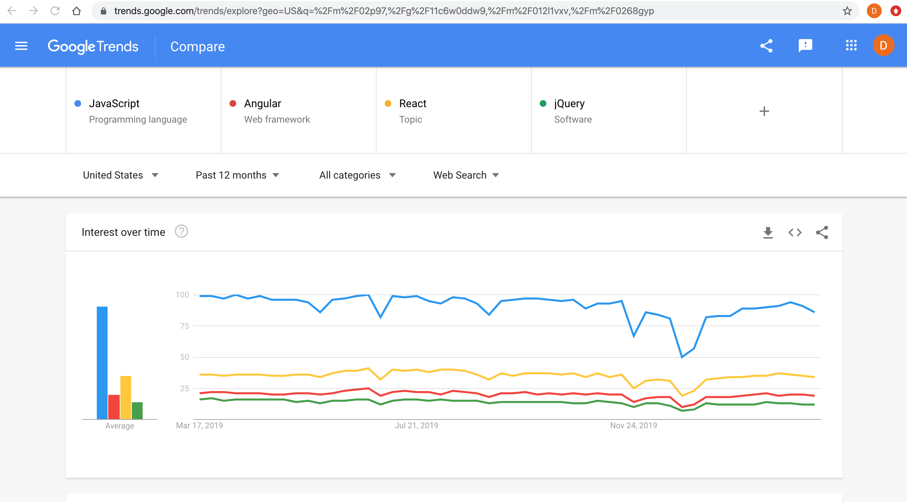
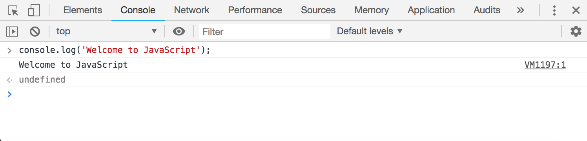
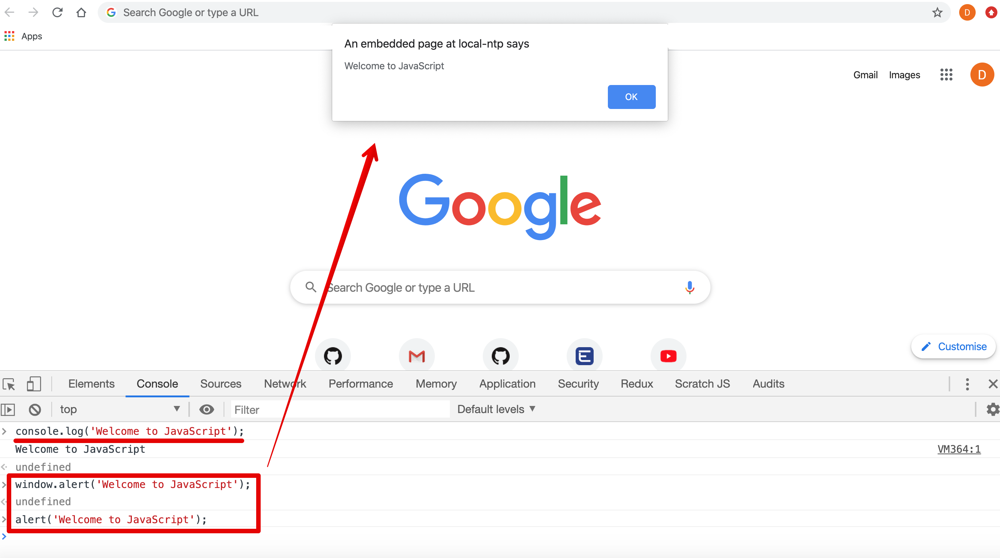

<p align="center">
  
</p>
    
JavaScript for Beginners
=====================
JavaScript tutorial for Beginners
=====================
JavaScript basics and fundamentals for all
=====================

Description
---------------------

JavaScript is a `scripting language of the web` that allows you to do/add Interactivity with User-Events, implement Conditions and Validations, Dynamic updates in a Web Page, etc.. In this practical course will learn JavaScript basics-programming fundamentals from scratch. We Will start with what is JavaScript? its uses, history, how to write JavaScript, etc. It will also cover various programming building blocks like variable, functions, array, conditionals, objects, and many more.

Topics (separate with spaces)
---------------------

Add topics to categorize your repository and make it more discoverable: 

- javascript-programming-language
- javascript-language-fundamentals
- javascript-basic-programming
- javascript-tutorial
- javascript-library
- learning-javascript
- javascript-programs
- variables-var-let-const
- conditions
- loops
- arrays
- objects
- events
- dom-document-object-model
- webdevelopment
- front-end-development
- webprogramming
- plain-javascript
- vanilla-javascript
- javascript-typescript-es6

Prerequisites for current course / What you need to know
---------------------

To move forward with JavaScript you just need basic knowledge of XHTML/HTML. Here, you will learn how easy it is to add interactivity to a web page using JavaScript. But, before we begin, make sure that you have some working knowledge and/or general understanding of:
- The Internet and the World Wide Web (WWW) [Web Design Development Foundations-Web Technology Fundamentals](https://github.com/dinanathsj29/web-design-development-fundamentals)
- Good working knowledge of HyperText Markup Language (HTML) [HTML5 Essentials](https://github.com/dinanathsj29/html5-essentials) and 
- Its good to know [CSS3 Fundamentals](https://github.com/dinanathsj29/css3-fundamentals)

Topics include
=====================

1. [Course Introduction](#section-01-course-introduction)
    - 01.01. [Welcome](#0101-welcome)
    - 01.02. [Who is this for? Audience](#0102-who-is-this-for-audience)
2. [Introducing JavaScript](#section-02-introducing-javascript)
    - 02.01. [Importance](#0201-importance)
    - 02.02. [What is JavaScript?](#0202-what-is-javascript)
    - 02.03. [What is a scripting language?](#0203-what-is-a-scripting-language)
    - 02.04. [What can you do with JavaScript?](#0204-what-can-you-do-with-javascript) | [Use of JavaScript?](#0204-use-of-javascript)
    - 02.05. [Where does the JavaScript code run?](#0205-where-does-the-javascript-code-run)
    - 02.06. [Who are using JavaScript?](#0206-who-are-using-javascript)
    - 02.07. [History of JavaScript](#0207-history-of-javascript)
    - 02.08. [JavaScript Vs ECMAScript](#0208-javascript-vs-ecmascript)
    - 02.09. [Types of Script](#0209-types-of-script) | [Various Scripting languages](#0209-various-scripting-languages) | [Client-Side Scripting Vs Server Side Scripting](#0209-client-side-scripting-vs-server-side-scripting)
    - 02.10. [Prerequisites of using HTML and JavaScript](#0210-prerequisites-of-using-html-and-javascript)
3. [JavaScript Getting Started](#section-03-javascript-getting-started)
    - 03.01. [How to write Javascript?](#0301-how-to-write-javascript) | [JavaScript in HTML](#0301-javascript-in-html)
    - 03.02. [Where to write JavaScript in HTML?](#0302-where-to-write-javascript-in-html) | [Where to embed include write put JavaScript in HTML?](#0302-where-to-embed-include-write-put-javascript-in-html)
    - 03.03. [JavaScript Code structure](#0303-javascript-code-structure)
    - 03.04. [JavaScript Keywords](#0304-javascript-keywords)
    - 03.05. [Comments](#0305-Comments)
4. [JavaScript Language Fundamentals](#section-04-javascript-language-fundamentals)
    - 04.01. [Generating Output](#0401-generating-output)
5. [Variables](#section-05-variables)
    - 05.01. [What is Variable?](#0501-what-is-variable)
    - 05.02. [Declaring variable without a value](#0502-declaring-variable-without-a-value) | [Creating a variable without a value](#0502-Creating-a-variable-without-a-value)
    - 05.03. [Declaring multiple variables at once](#0503-declaring-multiple-variables-at-once)
    - 05.04. [Variable Naming Conventions](#0504-variable-naming-conventions) | [Variable Naming Conventions (Identifiers)](#0504-variable-naming-conventions-identifiers)
    - 05.05. [Variable Scope](#0505-variable-scope)
    - 05.06. [The let and const keywords ES6](#0506-the-let-and-const-keywords-es6)
6. [Data types](#section-06-data-types)
    - 06.01. [Data types](#0601-data-types)
    - 06.02. [Primitive data type](#0602-primitive-data-type) | [Primitive, Primary or Value data type](#0602-primitive-primary-or-value-data-type)
    - 06.03. [Non-primitive data type](#0603-non-primitive-data-type) | [Non-primitive, Reference or Composite data type](#0603-non-primitive-reference-or-composite-data-type)
    - 06.04. [JavaScript has Dynamic Types](#0604-javascript-has-dynamic-types)
    - 06.05. [The typeof Operator](#0605-the-typeof-operator)
    - 06.06. [Type conversion](#0606-type-conversion) | [typeof parseInt parseFloat](#0606-typeof-parseint-parsefloat)
    - 06.07. [Type coercion](#0607-type-coercion)
7. [Operators](#section-07-operators)
    - 07.01. [What is the Operator?](#0701-what-is-the-operator)
    - 07.02. [Arithmetic Operators](#0702-arithmetic-operators)
    - 07.03. [Assignment Operators](#0703-assignment-operators)
    - 07.04. [Logical Operators](#0704-logical-operators)
    - 07.05. [Comparison Operators](#0705-comparison-operators) | [Relational Operators](#0705-relational-operators)
    - 07.06. [Conditional Operator](#0706-conditional-perator) | [Ternary Operator](#0706-ternary-operator)
    - 07.07. [String Operators](#0707-string-operators)
    - 07.08. [Operator precedence](#0708-operator-precedence)
8. [Functions](#section-08-functions)
    - 08.01. [What is a Function?](#0801-what-is-a-function)
    - 08.02. [Types of Function](#0802-types-of-function)
    - 08.03. [Different ways to define Function](#0803-different-ways-to-define-function)
    - 08.04. [String Methods and Concatenation](#0804-string-methods-and-concatenation)
    - 08.05. [Template String](#0805-template-string) | [Template Literals](#0805-template-literals)
9. [Loops](#section-09-loops) | [Loops and Iterations](#section-09-loops-and-iterations) 
    - 09.01. [The for loop](#0901-the-for-loop)
    - 09.02. [The while loop](#0902-the-while-loop)
    - 09.03. [The do while loop](#0903-the-do-while-loop)
    - 09.04. [The for in loop](#0904-the-for-in-loop)
    - 09.05. [The for of loop](#0905-the-for-of-loop)
    - 09.06. [Break and Continue statement](#0906-break-and-continue-statement)
    - 09.07. [for each loop](#0907-for-each-loop)
10. [Conditions - Control Flow](#section-10-conditions)
    - 10.01. [The if statement](#1001-the-if-statement) | [The if statement and comparison operators](#1001-the-if-statement-and-comparison-operators)
    - 10.02. [The if else statement](#1002-the-if-else-statement)
    - 10.03. [The if else if else statement](#1003-the-if-else-if-else-statement)
    - 10.04. [The switch case statement](#1004-the-switch-case-statement)
11. [Array](#section-11-array)
    - 11.01. [What is an Array?](#1101-what-is-an-array)
    - 11.02. [Create Array by array literal](#1102-create-array-by-array-literal)
    - 11.03. [Create Array by creating an instance of array directly](#1103-create-array-by-creating-an-instance-of-array-directly)
    - 11.04. [Create Array by using an array constructor](#1104-create-array-by-using-an-array-constructor)
    - 11.05. [Getting the Length of an Array](#1105-getting-the-length-of-an-array)
    - 11.06. [Accessing Looping through an Array Elements](#1106-accessing-looping-through-an-array-elements) | 
    [Loop through an Array Elements](#1106-loop-through-an-array-elements)
    - 11.07. [Adding Editing an Array Elements](#1107-adding-editing-an-array-elements)
    - 11.08. [Removing Deleting an Array Elements](#1108-removing-deleting-an-array-elements)
    - 11.09. [Array properties and methods](#1109-array-properties-and-methods)
12. [Objects](#section-12-objects)
    - 12.01. [Real Life Objects](#1201-real-life-objects) | [Object Properties and Method examples](#1201-object-properties-and-method-examples)
    - 12.02. [What is an Object?](#1202-what-is-an-object)
    - 12.03. [Object literal](#1203-object-literal)
    - 12.04. [Creating an instance of Object directly](#1204-creating-an-instance-of-object-directly)
    - 12.05. [Object constructor](#1205-object-constructor)
    - 12.06. [Accessing objects properties](#1206-accessing-objects-properties) | [Looping through Objects properties](#1206-looping-through-objects-properties)
    - 12.07. [Removing Deleting objects properties](#1207-removing-deleting-objects-properties)
    - 12.08. [Manipulating by Value Vs Reference](#1208-manipulating-by-value-vs-reference)
    - 12.09. [The Window object](#1209-the-window-object)
    - 12.10. [The Math Object](#1210-the-math-object)
    - 12.11. [Date and Time](#1211-date-and-time)
13. [Events](#section-13-events)
    - 13.01. [Understanding Events and Event Handlers](#1301-understanding-events-and-event-handlers)
    - 13.02. [Different Event category](#1302-different-event-category)
    - 13.03. [Different ways to write the event handler](#1303-different-ways-to-write-the-event-handler)
14. [DOM (Document Object Model)](#section-14-dom-document-object-model)
    - 14.01. [What is DOM?](#1401-what-is-dom) | [What is the Document Object Model?](#1401-what-is-the-document-object-model)
    - 14.02. [Node](#1402-node)
    - 14.03. [JavaScript DOM Selectors](#1403-javascript-dom-selectors)
    - 14.04. [JavaScript DOM CSS Styling](#1404-javascript-dom-css-styling)
    - 14.05. [JavaScript DOM HTML get set attributes](#1405-javaScript-dom-html-get-set-attributes)
15. [What's Next Step?](#section-15-whats-next-step)

Section 01. Course Introduction
=====================

01.01. Welcome
---------------------

Hi All, I'm **`Dinanath Jayaswal, Senior UI/Web Developer and Adobe Certified Expert Professional`**, I wanna welcome you to JavaScript for Beginners. In this course, I will take you through with the ins and outs of learning JavaScript. This course will help you to learn the fundamentals of programming with JavaScript scripting language, from the basics to advanced topics step-by-step.

01.02. Who is this for? Audience
---------------------

This course is for any Web Designer, Developer who is interested in dynamic Web Design and Development / Web Programming with JavaScript. Anyone who wants to make a career in Web Development or planning on being a front-end developer must learn JavaScript.

Section 02. Introducing JavaScript
=====================

02.01. Importance
---------------------

### 3 pillars / core Languages/Technologies used for Front End Web Design/Development:

1. **HTML (HyperText Markup Language)** - Markup language, Essential Page Structure/Content, Readable and convey structure to a user, Text Layout Model, page Mark-up, Text, Tags, Data, details for pages, Images, Tables, Anchor Links, Forms
    - HTML is an acronym stands for `HyperText Markup Language` which is used for creating `web pages and web applications`
    - HTML is not a programming language; it is a markup language that defines the structure of your content ie. document

2. **CSS (Cascading Style Sheet)** - Style Sheet language, Page Design / Presentation / Layouts / Styling / Formattings, look and feel, Creative part of Web Pages
    - CSS is a stylesheet language that allows you to control the appearance (look and feel) of your webpages

3. **`JavaScript (JS) - Scripting language, Dynamic Page Behaviour, Logics, Conditions and Validations, Events (mouse click, hover), Interactivity with User, Dynamic updates in a Web Page`**
    - JavaScript is a `scripting language of the web` that allows you to do Interactivity with User-Events, implement Conditions and Validations, Dynamic updates in a Web Page, etc.

> **Syntax & Example**: `02.01.js.intro.html`
```html
<!DOCTYPE html>
<html lang="en">

  <head>

    <meta charset="UTF-8">
    <meta name="viewport" content="width=device-width, initial-scale=1.0">
    <meta http-equiv="X-UA-Compatible" content="ie=edge">
    <title>02.01.js.intro.html</title>

    <!-- internal style -->
    <style>
    /* css selector: { property:value; } */
      body {
          font-family: arial;
      }
    </style>

    <!-- internal JavaScript - head section -->
    <script>
      // Write all JavaScript code here
      alert('welcome to JavaScript');

    </script>
  
  </head>

  <body>

    Content

    <!-- internal JavaScript - body section -->
    <script>
        /* Write all JavaScript code here */
        console.log('welcome to JavaScript');
        
    </script>

  </body>

</html>
```

02.02. What is JavaScript?
---------------------

- JavaScript is `1 of the 3 core language/layers` of web...(HTML, CSS & JavaScript)
- JavaScript is one of the most popular, widely used, lightweight scripting programming language
- JavaScript is an `Open Source`, `Cross-Platform`, and `Browser-based Client-Side (user computer)` programming language of the web
- JavaScript is a dynamic computer programming language. It is an `interpreted (translated)` programming language with `object-oriented capabilities`
- JavaScript is officially maintained by `ECMA (European Computer Manufacturers Association) as ECMAScript`
- ECMAScript 6 (or `ES6` or ECMAScript 2015) is the latest major version of the ECMAScript standard
- JavaScript is case sensitive language

> **Note**: <br/>
Now-a-days with the help of `Node (Node.js)` JavaScript is used for `Back-end (Server-side)` API development. JavaScript is not compiled language, but it is a translated language (JavaScript Translator (embedded in the browser engine) is responsible for translating the JavaScript code for the web browser.

<p>
  <figure>
    &nbsp;&nbsp;&nbsp; 
    <figcaption>&nbsp;&nbsp;&nbsp; Image 02.02.01 - Stackoverflow Programming, Scripting, and Markup Languages Survey 2019</figcaption>
  </figure>
</p>

<p>
  <figure>
    &nbsp;&nbsp;&nbsp; 
    <figcaption>&nbsp;&nbsp;&nbsp; Image 02.02.02 - Google Trends - Language Compare </figcaption>
  </figure>
</p>

02.03. What is a scripting language?
---------------------

- A high-level programming language that is interpreted by another program at runtime rather than compiled by the computer's processor as other programming languages
- A programming language designed for integrating and communicating with other programming languages
    - Popular scripting languages are `JavaScript, VBScript, PHP, Perl, Python, Ruby, ASP`
    - Since a scripting language is normally used in conjunction with another programming language, they are often found and used alongside `HTML, Java or C++`
- The simple difference between scripting language and programming language is: Scripting languages do not require the compilation step and are rather interpreted
    - `C program` needs to be compiled before running whereas normally, a scripting language like `JavaScript or PHP` need not be compiled
- Scripting is interpreted based language, whereas Java, C, C++, and others are compiler-based language

### What is a script?

- A script is nothing but sets of instructions
- Series of commands

02.04. What can you do with JavaScript?
---------------------
02.04. Use of JavaScript
---------------------

For a long time, JavaScript is used only as a `Client Side Front End Development language` to build browser-based interactive web pages. But currently due to huge community support `(Node or Nide.js) JavaScript is multi-purpose language` and used to develop:
- Full-fledged Enterprise Web Application
- Full-blown Mobile Apps
- Real-time Networking Apps (Chats, Audio/Video Streaming Services)
- Games
- Command Line Tools (CLI-Command Line Interface utilities)

### 02.04.01. JavaScript is used in billions of Web pages/web apps to add interactivity, validate forms and much more:

- JavaScript gives HTML designers a `programming tool`
- JavaScript can react to `events` (mouse click, hover (rollover, rollout), focus, blur)
- JavaScript can be used to `validate` data (`Client-side validation`)
- JavaScript can manipulate `HTML content` and `CSS styles` 
- Dynamic `drop-down menus`, HTML contents at run time/on the fly
- Displaying live/current/dynamic `date and time (clocks)`
- Displaying `pop-up windows` and `dialog boxes` (an `alert`, `confirm` and `prompt` dialog box)
- Change the website's `behavior` and make it more `dynamic with advanced` web designs
- Perform and `control transitions` and `animations`

### However, there are more serious uses for javascript:

- **Browser Detection** - Detecting the browser used by a visitor
- **Cookies** - Storing information on the visitor's computer
- **Control Browsers** - Opening pages in customized windows
- **Validate Forms** - Validating inputs to fields before submitting a form

02.05. Where does the JavaScript code run?
---------------------

JavaScript was originally designed and developed to run only in browsers. But now with the help of the `Node/Node.js (C++ program, that includes Google's V8 JavaScript engine)` we can build the back-end(server-side) for our web and mobile applications.

### Common JavaScript Browser Engines

| Browser                                      |   Engine                                  |
| ---------------------------------------------|-------------------------------------------|
| **Browser, Headless Browser, or Runtime**    | **JavaScript Engine**                     |
| Mozilla                                      | Spidermonkey                              |
| Safari**                                     | JavaScriptCore*                           |
| IE and Edge                                  | Chakra                                    |
| Chrome                                       | V8                                        |
| TrifleJS                                     | V8                                        |
| Node.js***                                   | V8                                        |
| Io.js***                                     | V8                                        |
| PhantomJS                                    | JavaScriptCore                            |
| HTMLUnit                                     | Rhino                                     |
| | |

02.06. Who are using JavaScript? 
---------------------

- JavaScript is used by:
    - Front-end Developer
    - Back-end Developer
    - Full-stack Developer

- Big companies and brands build entire applications: 
    - Netflix
    - Walmart
    - PayPal
    - Microsoft
    - Facebook (React.js)
    - Google (Angular.js)
    - Ebay
    - Uber
    - Groupon

02.07. History of JavaScript
---------------------

- Invented by `“Brandan Eich”` at `Netscape` in `1995` originally named as `"LiveScript"`
- `Netscape` & `Sun Java` agreements to rename `"LiveScript"` to `"JavaScript"` (As `java` is already popular in the market)
- Not at-all related to `JAVA` (completely different in concept and design)
- `Microsoft` has developed new version of "JavaScript" as `"JScript"` for `IE-3` in `1996`
- JavaScript Submitted to `ECMAScript in 1997`

02.08. JavaScript Vs ECMAScript
---------------------

| JavaScript                                  | ECMAScript                                  |
| :-------------------------------------------|:--------------------------------------------|
| JavaScript is `scripting programming language`        | ECMAScript is a `specification/standard`             |
| JavaScript is invented by `Brandan Eich` at `Netscape`| ECMAScript standards defined by `ECMA (European Computer Manufacturers Association)` |
| JavaScript is released in 1995                        | First ECMAScript standard published in 1997          |
| JavaScript uses/follows ECMAScript specifications/standards | ECMAScript specification defines many new features for JavaScript |
| | |

02.09. Types of Script
---------------------
02.09. Various Scripting languages
---------------------
02.09. Client-Side Scripting Vs Server Side Scripting
---------------------

| Client-Side Scripting                     | Server-Side Scripting                     |
| ------------------------------------------|-------------------------------------------|
| Instruction for web Browser               | Instruction for web Server                |
| Client-side scripting is used when the user's browser already has all the code and the page is altered based on the user's input     | Server-side scripting is used to create dynamic pages based several conditions when the user's browser requests the server       |
| Response from a client-side script is faster as compared to a server-side script because the scripts are processed on the local computer | Response from a server-side script is slower as compared to a client-side script because the scripts are processed on the remote computer (server) |
| Client-side scripting languages such as JavaScript, VBScript, etc. are interpreted and executed by the web browser | Server-side scripting languages such as ASP, PHP, Java, Python, Ruby, etc. run on the webserver and the output sent back to the web browser in HTML format
| **Example**: Javascript, VB script, ActionScript, HTML, XHTML etc.  | **Example**: ASP, JSP, PHP, ASP#.Net, Perl, Ruby, Python, CGI etc.
| | |

02.10. Prerequisites of using HTML and JavaScript
---------------------

### Tools for building web sites-web pages/writing HTML, CSS & JavaScript

1. **Text Editor/HTML Editor/Code Editor/Visual Code Editor** - `NotePad, NotePad++, SublimeText, Atom, Brackets, Coda, Visual Studio Code, DreamWeaver` etc.
    - Just visit registered website of any of your favorite editor, download and install it (like **Visual Studio Code** = https://code.visualstudio.com)
    - A JavaScript file (.js) is a text file itself consists of JavaScript code/statements, so to create/modify a JavaScript file we can use any text editors

2. **Browsers - To view output of .html pages with .js files** - `Google Chrome, Mozilla Firefox, Internet Explorer, Safari` etc.
    - Once the .html/.htm file created and saved, we can create a .js file and link within HTML and then we can see its output in any latest web browser

3. **JavaScript Output / Debugging Tool (Developer console)** - 
    - alert() or window.alert()
    - console.log()
    - Google Chrome / Safari – `Developer Tools Inspect` / Inpsect element (in browser -> Right Click on page -> choose `Inspect / Inspect Element -> Console Tab`
    - Mozilla FireFox – `Firebug`

> **Note**: <br/> 
Use `F12` key on the keyboard to open the `developer tools` then click on the `Console Tab`, OR on empty area in browser page `Right Click -> Inspect (Developer Tool) -> Console Tab`. Here You can write basic JavaScript statements and/or valid JavaScript code directly in browser console panel/tab and get the output

<p>
  <figure>
    &nbsp;&nbsp;&nbsp; 
    <figcaption>&nbsp;&nbsp;&nbsp; Image 02.10.01 - Widely used modern browsers</figcaption>
  </figure>
</p>

<p>
  <figure>
    &nbsp;&nbsp;&nbsp; 
    <figcaption>&nbsp;&nbsp;&nbsp; Image 02.10.02 - Developer Tool Inspect Console</figcaption>
  </figure>
</p>

<p>
  <figure>
    &nbsp;&nbsp;&nbsp; 
    <figcaption>&nbsp;&nbsp;&nbsp; Image 02.10.03 - Developer Tool Inspect Console</figcaption>
  </figure>
</p>

Section 03. JavaScript Getting Started
=====================

03.01. How to write Javascript?
---------------------
03.01. JavaScript in HTML
---------------------

- The HTML `<script>.....</script>` tag is used to embed/insert/implement a JavaScript programs/code into any part of an HTML document/page
- The `<script>.....</script>` tag specifies that we are using JavaScript
- The `<script>.....</script>` element can be placed in the `<head>`, or `<body>` section of an HTML document
- Each `<script>.....</script>` tag blocks the page rendering process until it has fully downloaded and executed the JavaScript code
  - So the best practice is to place/add the `<script>.....</script>` at the bottom/end of `body` tag/section ie. just before the closing `</body>` tag

> **Note**: <br/>
JavaScript is the default scripting language in HTML. The old HTML standard attributes like `type="text/javascript"` and `language="javascript"` no longer required in modern browser 

> **Syntax & Example**: `03.01.js.script.tag.html`
```html
<head>

    <meta charset="UTF-8">
    <meta name="viewport" content="width=device-width, initial-scale=1.0">
    <meta http-equiv="X-UA-Compatible" content="ie=edge">
    <title>03.01.js.script.tag.html</title>

    <!-- internal style -->
    <style>
      /* css selector: { property:value; } */
      body {
        font-family: arial;
      }
    </style>

    <!-- internal JavaScript - head section -->
    <script>
      // Write all JavaScript code here
      alert('welcome to JavaScript');

    </script>
    
</head>

<body>
    
    Content

    <!-- internal JavaScript - body section -->
    <script>
      /* Write all JavaScript code here */
      console.log('welcome to JavaScript');
      document.write('This is dyanamic content. Hello All, Lets write something on web page');
      
    </script>
    
</body>
```

03.02. Where to write JavaScript in HTML?
---------------------
03.02. Where to embed include write put JavaScript in HTML?
---------------------

### JavaScript provides 3 places to write the JavaScript code in our webpage:
1. Inside the HEAD section
2. Inside the BODY section
3. External JavaScript .js file (separation of concern)

### 03.02.01. Inside the HEAD section (code between the head tag)

- JavaScript programs/code/statements can be placed in the `<head>` section of an HTML page
- As each `<script>.....</script>` tag blocks the page rendering process until it has fully downloaded and executed the JavaScript code so placing them in the `head section (<head> element` of the document without any valid reason will significantly impact your website performance

> **Syntax & Example**: `03.02.01.js.head.html` 
```html
<head>

    <!-- internal JavaScript - head section -->
    <script>
        // Write all JavaScript code here
        alert('welcome to JavaScript written in head section');

    </script>

</head>
```

### 03.02.02. Inside the BODY section (code between the body tag)

- JavaScript programs/code/statements can be placed in the `<body>` section of an HTML page
- As blocking nature of `<script>.....</script>` tag ideally, scripts should be placed at the end of the `body section`, just before the `closing </body> tag`, it will make your web pages load faster since it prevents obstruction of initial page rendering

> **Syntax & Example**: `03.02.02.js.body.html`
```html
<body>

    page content

    <!-- internal JavaScript - body section -->
    <script>
        // Write all JavaScript code here
        alert('welcome to JavaScript written in body section');
        console.log('welcome to JavaScript written in body section');
        document.write('<h2>welcome to JavaScript written in body section</h2>');

    </script>

</body>
```

### 03.02.03. External JavaScript .js file (separation of concern)

- We can easily write JavaScript code in between the `script element`. In a real-world application, we have 100+ maybe even 1000+ lines of code, we don't want to write all that code inline here
- We must have to `extract and separate` our JavaScript behavior code from our HTML markup code
- A simple thumb-rule is if we have a lot of JavaScript code, we can put it into a separate file
- We can use/add/attach an external JavaScript file by using `<script>` tag with `src (source)` attribute:
    - ```<script src="path/scriptfile.js"></script>```
    - One can provide a `full URL (absolute path)` or `relative path` from the current page
- We can create a single external JavaScript file and embed it in many/any HTML page which provide `code re-usability`

### 03.02.04. Advantages of External JavaScript 

- It separates HTML and JavaScript code (separation of concern)
- Code re-usability
- It makes HTML and JavaScript file/code easier to read, maintain and more meaningful/semantic
- Web page loads faster /increase the speed of the webpage (Cached JavaScript files)

> **Note**: <br/>
Usually, when an external JavaScript file is downloaded for the first time, it is stored in the browser's cache (like images and style sheets), so it won't need to be get downloaded multiple times from the web server that makes the web pages load faster/quickly.

> **Syntax & Example - `.html file`**: `03.02.03.js.external.html`
```html
<body>

    page content

    <!-- include external JavaScript - body section -->
    <script src="./03.script.js"></script>
    
</body>
```

> **Syntax & Example - `.js file`**: `03.02.03.script.js`
```javascript
// external js file
// Write all JavaScript code here

alert('welcome to JavaScript written in external file');
console.log('welcome to JavaScript written in external file');
document.write('<h2>welcome to JavaScript written in external file</h2>');
```

03.03. JavaScript Code structure
---------------------
The syntax of JavaScript is the `set of rules` that define a correctly structured JavaScript program. Let's study some of the building blocks of JavaScript code:

### 03.03.01. JavaScript Statements

- One line of JavaScript Code is one JavaScript Statement / Instruction / Command
- Statements are a command to Browser to do something / perform actions
- A Statement is a piece of code that expresses an action to take place
- JavaScript code/program (or just JavaScript) is a sequence of statements
- Statements are written in-between `<script>.....</script>` tag
- Statements are separated by `Semicolon;` so we may write many statements in a line (optional)
- JavaScript ignores extra line breaks and white spaces
- JavaScript is case sensitive language (VB, Pascal, HTML are case insensitive)
- JavaScript is interpreted not compiled (write and handed over to the web browser)
- All statement in JavaScript should be terminated by a `Semicolon;` 

> **Note**: <br/>
JavaScript statements are composed of: **`Values, Operators, Expressions, Keywords, and Comments`**

### 03.03.02. Whitespace and Line Breaks

- JavaScript ignores `spaces, tabs, and newlines` that appear in JavaScript programs
- We can freely use spaces, tabs, and newlines to format and indent programs in a neat-clean and consistent way that makes the code easy to read and understand (not advisable)

### 03.03.03. Semicolons

- JavaScript statements are generally followed by a `semicolon; character`
- A semicolon may be omitted in `most cases` when a line break exists
- JavaScript interprets the line break as an `implicit` semicolon, called an `automatic semicolon insertion`
- **In most cases, a newline implies a semicolon, But “in most cases” does not mean “always”!**

> **Note**: <br/>
It is a good programming practice to use semicolons; after every statement

### 03.03.04. Case Sensitivity

- JavaScript is a case-sensitive language
- in Javascript variables, language keywords, function names, and other identifiers must always be typed with a consistent capitalization of letters
- **Example**: `var firstName='Dinanath';` and `var FirstName='Dinanath';` here `firstName & FirstName` are different ie. two different variable

> **Note**: <br/>
Take care/precautions while writing variable and function names in JavaScript

### 03.03.05. JavaScript Code Blocks

- JavaScript commands/statements/code can be grouped together in code blocks, `inside curly brackets {...}`
- Grouped statements/lines form code blocks
- The purpose of code blocks is to define statements to be executed together like a single JavaScript command
- An often occurrence of a code block in JavaScript is a JavaScript `function`

> **Syntax & Example**: `03.03.05.script.js`
```javascript
// external js file
// Write all JavaScript code here

// define function - block of code to show welcome message
function sayHello() {
  alert('Hello All! Welcome to JavaScript!!');
}

// define function - block of code to show total of two numbers
function showTotal() {
  var num1 = 10;
  var num2 = 20;
  var total = num1 + num2;
  alert('Total is : ' + total);
}

// invoke / run  / call a function
sayHello();
showTotal();
```

03.04. JavaScript Keywords
---------------------

Usually, JavaScript commands/statements start with a `specific keyword` which defines what `action/function` should the browser will perform/do:

| Keyword           | Keyword          |Keyword           | Keyword          |Keyword           |
| ------------------|------------------|------------------|------------------|------------------|
| break             | do ... while     | if ... else      | try ... catch    | const            |
| continue          | for              | return           | var              | class            |
| debugger          | function         | switch           | let              | import           |
| | | | | | 

### 03.04.01. Reserved Keywords

JavaScript has several reserved keywords. These are the words that you cannot use as identifiers (variable names, function names, and loop labels) in your JavaScript programs. The following list shows the keywords that are reserved in `ECMAScript 6`. It also includes keywords that are `reserved for future` as well as keywords that are `disallowed in strict mode`.
- arguments, await, break, case, catch, class, const, continue, debugger, default, delete, do, else, enum, eval, export, extends, false, finally, for, function, if, implements, import, in, instanceof, interface, let, new, null, package, private, protected, public, return, static, super, switch, this, throw, true, try, typeof, var, void, while, with, yield, 

03.05. Comments
---------------------
- The comments are a meaningful way to `deliver the message (description to code)` for others/for future reference and to understand/follow the code statements/lines
- Comments are special lines written for other developers as a reference purpose and browser ignores while interpreting
- It is used to add information about the code, warnings or suggestions so that end-user can easily interpret the code (`Why and How of code/program/logic`)
- Comments are used to explain code/programs/statements and to make it more readable for developers
- A comment is ignored by the JavaScript engine embedded in the browser
- Comments can also be used to prevent the execution of certain logic when testing code
- Comments can be put into any place of a script, they don’t affect its program execution because the engine simply ignores them
- Comments help to `make code easy to understand` and `it avoids the unnecessary code`

### 03.05.01. Types of JavaScript Comments

There are two types of comments in JavaScript:
1. Single-line Comments
2. Multi-line Comments

#### 03.05.01.01. Single-line Comments

- Single-line JavaScript comments are used for one line of comment only
- Single-line comments starts with `two forward slash`: **// is single comment**
- Any statements between `//` till the end of the line will be ignored by JavaScript (not be executed)
- Single-line comments do not need closure/closing

> **Syntax & Example**: `03.05.script.js`
```javascript
// external js file
// Write all JavaScript code here

// show alert box
alert('Welcome to JavaScript!');

var firstName = 'Dinanath'; // variable to store firstName
var lastName = 'Jayaswal'; // variable to store lastName
```

#### 03.05.01.02. Multi-line Comments

- Multi-line comments usually comment out a block of code
- Multi-line comments in JavaScript can comment on bigger parts (a few lines) of code
- Multi-line comments are more convenient as it can be used to comment single as well as multi-line comments
- Multiline comments start with `forward slash and an asterisk, /* and also end with an asterisk and a forward slash */`:  /* multi-line comment */
- Multi-line comments need closing
- Multi-line comments are more often used for `formal documentation`

> **Syntax & Example**: `03.05.script.js` 
```javascript
/* show alert box */
alert('Welcome to JavaScript!');

/* This is a multiline comment.
A code block can be commented on. */

/* var firstName = 'Dinanath'; // variable to store firstName
var lastName = 'Jayaswal'; // variable to store lastName */
```

Section 04. JavaScript Language Fundamentals
=====================

04.01. Generating Output
---------------------
- JavaScript does not have any `display or built-in print` functions
- Many times we may need to generate output from your JavaScript code like `see the value of a variable`, or `write a message to browser console` to help you `debug an issue` in your running JavaScript code, and so on
- That is why you have to use the JavaScript output function to generating output `(browser window or browser console dialog boxes, writing output into an HTML element, etc.)`
- Using different output methods knowledge will help you while debugging or rewriting your code more conveniently

### Different ways to show output/display data

1. Writing into an alert box with `alert() or window.alert()`
2. Writing into browser console with `console.log()`
3. Writing into the HTML / Browser Window  with `document.write()`
4. Write into an element of HTML / Inserting Output Inside an HTML Element with `innerHTML`

#### 04.01.01. Displaying Output in Alert Dialog Boxes: alert() or window.alert()
- One can use `alert dialog boxes` to display the message or output data to the user 
- An alert dialog box is created using the `alert() or window.alert()` method
- A small pop-up box appears with a closing button to close alert-box
- This method is great for short and rapid informative messages which can be instantly closed

> **Syntax & Example**: `04.01.01.script.js`
```javascript
// external js file
// Write all JavaScript code here

alert('I am Dinanath Jayaswal');
window.alert('We are learning JavaScript');
```

#### 04.01.02. Writing Output to Browser Console: console.log()

- Programmers can easily output a message or write data to the browser console using the `console.log()` method
- `console.log()` function is mainly/widely used for `debugging code` as it makes the JavaScript output print to console
- This is a simple, easy but very powerful method for generating detailed output

> **Syntax & Example**: `04.01.02.script.js`
```javascript
// external js file
// Write all JavaScript code here

console.log('I am Dinanath Jayaswal');
console.log('We are learning JavaScript');
```

> **Note**: <br/>
Use `F12` key on the keyboard to open the `developer tools` then click on the `console tab`. You can write basic JavaScript statements directly in the browser console panel/tab and get the output.

#### 04.01.03. Writing Output into the HTML / Browser Window: document.write()

- `document.write()` method is used to write the content to the current document while document is being parsed
- Programmers do ues document.write() for `testing purposes`

> **Syntax & Example**: `04.01.03.script.js`
```javascript
// external js file
// Write all JavaScript code here

document.write('I am Dinanath Jayaswal');
document.write('We are learning JavaScript');
```

#### 04.01.04. Inserting Output Inside an HTML Element: innerHTML

- We can write or insert output inside an HTML element using the element's `innerHTML` property
- First we need to select the element using a method such as `document.getElementById(id)` 

> **Note**: <br/>
HTML element manipulating is fully dependent on JavaScript DOM manipulation concepts

> **Syntax & Example**: `04.01.04.script.js`
```javascript
/// external js file
// Write all JavaScript code here

// Writing text string inside an element
document.getElementById('mainHeadingText').innerHTML = 'Heading Text change dynamically on run-time';

var paraText = document.getElementById('mainParaText');
paraText.innerHTML = '<strong>This Paragraphic text inserted dynamically through innerHTML method.</strong>';
```

With JavaScript, we can do many cool and dynamic pieces of stuff (Image Gallery, Games, Forms) but for that one should be familiar with core essentials/building blocks of JavaScript programming language like Variables, Functions, Operators, Loops, Conditional Statements, Array, Objects, Events, DOM (Document Object Model), etc. which will cover in coming lessons.

Section 05. Variables
=====================

05.01. What is Variable?
---------------------

Variables are one of the most fundamental concepts in JavaScript and other all programming languages of the world.

- A variable is `container to store/hold the data/information`
- Developers/Programmers use Variable to `store/hold the data/information temporarily` in computer memory 
- A variable is a kind of data holder where we can store some value for programming or calculation purpose
- A JavaScript variable is simply a `name of the storage location (named containers/named storage)` for data
- Variables are symbolic names for values 
- Variables are used to store data of different types like a string of text, numbers, boolean values like true/false, an array of data, etc. 
- The data or value stored in the variables can be set, updated, and retrieved whenever needed
- Variables are declared using the keyword `var` keyword
- The `assignment operator (=)` is used to assign value to a variable, like this: `var varName = value;` or `var firstName = 'JavaScript';`
- By default value of variable defined in JavaScript is `undefined` (variable is defined but value not assigned: `var firstName;` or `let lastName; console.log(firstName, lastName); ` // undefined)

<hr/>

- **Example**: Variables are like `box or an envelope` which we use to `organize various kinds of stuff` and put a `label` on each box or an envelope
- **Example**: Variable declaration and assignment is just `like Maths & Algebra`: `x = 10`; and in JavaScript we write `var x = 10;`

<hr/>

> **Note**: <br/>
In ES6 `'let'` and `'const'` keywords are used to defined variables

> **Note**: <br/>
As a best practice of ES6, from now onwards variables must be define with `let` keyword: `let techName = 'JavaScript' ; `

<hr/>

> **Syntax & Example**: `05.01.script.js`
```javascript
// variables defined to hold different types of data
var techName = 'JavaScript'; // String literal 
var version = 6; // Number literal
var isDone = true; // Boolean literal

console.log('Learning '+techName+version);
```

05.02. Declaring variable without a value
---------------------
05.02. Creating a variable without a value
---------------------

Variables can also be declared without having any initial values assigned to them. This is useful for variables that are supposed to hold values like user inputs, calculations, status updates, etc.

> **Syntax & Example**: `05.01.script.js`
```javascript
// Declaring Variables
var techName;
var version;
var isDone;

// Assigning value
techName = 'JavaScript';
version = 6;
isDone = true;

console.log('Learning '+techName+version);

// ------------------------------

// Declaring Variable
var userName;

// Assigning value
userName = 'Dinanath';

console.log('Welcome '+userName);
```

05.03. Declaring multiple variables at once
---------------------

We can also `declare multiple variables` and set their initial values in a single statement, each variable is `separated by comma`.

> **Syntax & Example**: `05.01.script.js`
```javascript
// Declaring multiple variables
var techName = 'JavaScript', version = 6, isDone = true;

// Declaring multiple variables in multiple lines for readability
var techName = 'JavaScript', 
version = 6, 
isDone = true;

console.log('Learning '+techName+version);

// ------------------------------

// Declaring multiple variables
var firstName = 'Dinanath', lastName = 'Jayaswal', age = 35, isMarried = 'true';

// Declaring multiple variables in multiple lines for readability
/* var firstName = 'Dinanath', 
lastName = 'Jayaswal', 
age = 35, 
isMarried = 'true'; */

console.log('I am ' + firstName + ' ' + lastName);
```

05.04. Variable Naming Conventions
---------------------
05.04. Variable Naming Conventions (Identifiers)
---------------------

All JavaScript variables must be `identified`/referred/defined/named with `unique names`, called as `identifiers`. The naming rules in JavaScript are not much different from any other programming language. 

- There are some rules while declaring/naming a JavaScript variable (also known as `identifiers`)
  - Identifiers are `simply names` in JavaScript
  - Identifiers are used to name variables, keywords, functions, and labels
  - Identifiers can be `short names/nick names` (like name, age, num1, isDone, sum) or more descriptive names (firstName, totalDashboards, isSeniorCitizen)

**The basic rules for defining/assigning names for variables (unique identifiers) are:**

- A variable name must `start with a letter, underscore (_), or dollar sign ($)`
  - **Example**: var firstName, var _firstName, var $firstName;
- Names can contain letters, digits, underscores, and dollar signs
  - **Example**: var $num_total1; 
- A variable name `cannot start with a number or special characters`
  - **Example**: var 1num_total, var .num_total
- A variable name `cannot contain spaces`
  - **Example**: var num total;
- A variable Names are `case sensitive`
  - **Example**: var firstName='Dinanath'; and var FirstName='Dinanath'; here `firstName & FirstName` are different ie. two different variable
- A variable name cannot be a `JavaScript keyword or a JavaScript reserved word`
   - **Example**: var var; var switch; var for; var true;
- One should Always give `meaningful/descriptive names` to variables
- for naming the variables that contain multiple words, `camelCase` method is commonly used (camelCase is the default method for identifier naming)

> **Note**: <br/>
In the programming world, there have been two most popular methods/mechanism of writing multiple words identifiers: (Underscore, Camel Case)

1. **Underscore**: first_name, last_name, date_of_birth, is_passed, native_place
2. **Camel Case:**: firstName, lastName, dateOfBirth, isPassed, nativePlace  OR <br/> : FirstName, LastName, DateOfBirth, IsPassed, NativePlace 

> **Syntax & Example**: `05.04.script.js`
```javascript
// variables defined to hold different types of data
var _firstName = 'JavaScript';
var $version = 6;
var $num_total1 = 10;

window.alert('variables details: ' +  _firstName + ' ' + $version + ' ' + $num_total1);

// wrong identifiers
// var #name;
```

05.05. Variable Scope
---------------------

The scope of a variable is the region/coverage of your program in which it is defined and exist/available. JavaScript variables have two scopes:
1. Local Variables
2. Global Variables

#### 05.05.01. Local Variables

- A JavaScript local variable is declared `inside block or function`
- It is accessible within the `function or blocks only`
- A local variable will be `visible only within a function` where it is defined
- `Function parameters` are always local to that function

> **Note**: <br/>
In the function body, a `local variable takes precedence` over a global variable with the same name.

> **Syntax & Example**: `05.05.01.script.js`
```javascript
// global variable
var globalName = 'Global';

window.alert(globalName);

function showName() {
  // local variable
  var localName = 'Local';

  window.alert(localName);
  window.alert(globalName); // recall global variable
}

// invoke/call/run function
showName();

// error - as local variable not exist/available outside of block { }
window.alert(localName);
```

#### 05.05.02. Global Variables

- A variable `declared outside the function/at the root` or declared `with window object` is known as a global variable 
- A JavaScript global variable is accessible from any function 
- A global variable has a global scope which means it can be defined and accessible anywhere in JavaScript code/program

> **Syntax & Example**: `05.05.02.script.js`
```javascript
// global variable
var globalName = 'Global';

window.alert(globalName);

function showName() {
  // local variable
  var globalName = 'Local';

  window.alert(globalName);

  // define global variable with window
  window.globalVersion = 29;
  window.alert('global variable from inside function: ' + window.globalVersion);
}

// invoke/call/run function
showName();

// access global variable defined inside function
window.alert('global variable from outside function: ' + window.globalVersion);
```

05.06. The let and const keywords ES6
---------------------
ES6 introduces two new keywords `let` and `const` for declaring variables. The `var, let and const` keywords are almost the same, just a few differences with the scope.

- In older programs` var` is used a lot which declares a variable `(function-scoped variables)`, but in a slightly different `old` way, with scope issues 
- Both `let` and `const` keywords declare variables, `scoped at block-level ({})` 
- Block scoping means that a new scope is created `between a pair of curly brackets {}`

### 05.06.01. The let Keyword

`ES6` introduces the new `let` keyword for declaring variables. Prior to ES6, the only way to declare a variable in JavaScript was the var keyword. Let's see what's the difference:
- Variables declared with the `var` keyword are `function-scoped` and can be `hoisted` at the top within its scope
- Variables declared with `let` keyword are `block-scoped ({})` and they are not hoisted

> **Syntax & Example**: `05.06.01.script.js`
```javascript
// traditional var syntax
var techName1 = 'JavaScript';

for(var i = 1; i <= 5; i++) {
  console.log('i : ' + i); // 1,2,3,4,5
  console.log('inside block:' + techName1);
  var version1 = 100;
}
console.log('outside: ' + i); 
console.log('outside: ' + version1); 

// ------------------------------

// ES6 syntax
let techName2 = 'LiveScript';

for(let n = 1; n <= 5; n++) {
  console.log('n : ' + n); // 1,2,3,4,5
  console.log('inside block:' + techName2);
  let version2 = 100;
}

console.log(n); // undefined
console.log('outside: ' + version2);  // undefined
```

### 05.06.02. The const Keyword

`ES6` introduces the new `const` keyword for declaring variables. 
- Use `const` to declare a constant `(read-only / unchanging)` variable
- Constants are `read-only`, you `cannot reassign new values` to them
- In Programm/logic when the variable will never change, they can be declared as `const`
- constants are named using capital letters and underscore **Example**: const NATIVE_CITY
- `const` are also `block-scoped` like `let`
- However, you can change `object properties` or `array elements`

> **Syntax & Example**: `05.06.02.script.js`
```javascript
// traditional var syntax
var PI1 = 3.14;
console.log(PI1); // 3.14

PI1 = 100;
console.log(PI1); // 100

// ------------------------------

// ES6 syntax
const PI2 = 6.28;
console.log('ES6 syntax const: ' + PI2); // 6.28

PI2 = 100; // error
```

Section 06. Data types
===================== 

06.01. Data types
---------------------

A variable in JavaScript can contain `any type of data`. Data types specify what `kind of data` can be stored and manipulated within the variable in a program. In JavaScript, different data types are available to hold different types of values/data. There are `two main categories/types` of data types in JavaScript:
1. Primitive (Primary or Value) data type
    - String
    - Number
    - Boolean
    - Undefined
    - Null
    - Symbol (newly introduced in ES6)
2. Non-primitive (Reference or Composite) data type
    - Array
    - Object
    - Function

06.02. Primitive data type
---------------------
06.02. Primitive, Primary or Value data type
---------------------

Primitive data types can `hold only one value at a time`. Primitives are `compared by value`. Two values are strictly equal if they have the same value.

There are different types of primitive data types in JavaScript. They are as follows:

| Data Type       | Description                                                                 |
| ----------------|-----------------------------------------------------------------------------|
| String          | represent textual data. e.g. "welcome" or 'to javascript'                   |
| Number          | represents numeric values e.g. 10, 100.29                                   |
| Boolean         | represents boolean value either false or true                               |
| Undefined       | represents an undefined value (a variable declared but value not assigned)     |
| Null            | represents null i.e. no value at all                                        |
| | |

### 06.02.01. String

- The string data type is used to `represent textual data (i.e. sequences of characters)`
- Strings hold information in `words/text`
- A string in JavaScript must be surrounded by `"double"` or `'single'` quotes
- **Example**: `06.02.script.js`

```js
var firstName = "Java"; 
var lastName = 'Script';
```

### 06.02.02. Number

- The number data type simply defined without quotes is used to represent positive or negative numbers with or without a decimal place
- Many mathematical operations can be done on numbers, e.g. `multiplication *, division /, addition +, subtraction`, and so on
- **Example**: 

```js
var age = 25; 
var id = 1;
```

### 06.02.03. Boolean

- The Boolean data type can hold only two values: `true or false`
- true = ON / yes / correct / 1, false = OFF / no, incorrect / 0
- Boolean data types is often used in `conditional testing` of code
- **Example**: 

```js
var isDone = true; 
var isMarried = false;
```

### 06.02.04. Undefined

- The meaning of undefined is `“value is not assigned”`
- The undefined data type can only have one value-the special value undefined
- A Variable has been declared, but `not assigned a value`
- A variable `without a value`, The type is also undefined
- **Example**: 

```js
var firstName;
var country;
```

### 06.02.05. Null

- A null value means that there is no value
- The special value which represents `“ nothing”, “empty” or “value unknown”`
- It is not equivalent to an empty string ('' or ' ', "", " "), it is simply nothing
- **Example**: 

```js
var firstName = null;
var id = null;
```

06.03. Non-primitive data type
---------------------
06.03. Non-primitive, Reference or Composite data type
---------------------

- Non-primitive/Reference data types can hold `collections of values and more complex entities`
- Non-primitive values are being compared by `reference` instead of value
- Data does not store in the variables but stored on the heap - a dynamically allocated memory reference
- Its a pointer to a location in memory, accessed by reference

There are different types of non-primitive data types in JavaScript. They are as follows:

| Data Type       | Description                                                           |
| ----------------|-----------------------------------------------------------------------|
| Array           | represents a group of similar value (multiple values in one variable) |
| Object          | represents an instance through which we can access members (property & value) |
| Function        | represents function (bunch/block of line to execute once)             |
| | |

06.04. JavaScript has Dynamic Types
---------------------

We have two types of programming languages:
1. Static languages
    - Declare a variable, the type of the variable is set and it cannot be changed in the future
2. Dynamic languages
    - Variable can change at run time (one variable can store different types of value as per requirement, we again assign any value any time as per logic, requirements)

- A JavaScript `variable can contain/hold any data ie. any type of data`, A variable at one moment can be a number and at another moment be a string, boolean 
- It simply means that `same variable can be used to hold different data types`
- JavaScript is a dynamic type language, means you don't need to specify a type of the variable because it is dynamically used by JavaScript engine

> **Syntax & Example**: `06.04.script.js`
```javascript
let name = 'JavaScript';
name = false;
name = 100;

alert(name);
alert(typeof(name));
```

06.05. The typeof Operator
---------------------

- The typeof operator returns the `type of the argument`
- It’s useful to process values of different types differently or want to perform a quick data type check
- The typeof operator can be used to find out what `type of data a variable` or operand contains
- It can be used with or without parentheses `(typeof(x)` or `typeof x`

> **Syntax & Example**: `06.05.script.js`
```javascript
// use typeof to find data type of variables
// Strings
alert(typeof "Hello"); // "string"
alert(typeof '12'); // "string"

// Numbers
console.log(typeof(100)); // "number"
console.log(typeof(100.29)); // "number"

// Booleans
alert(typeof true); // "boolean"
alert(typeof(1 == 2)); // "boolean"

// Undefined
console.log(typeof undefined); // "undefined"

var init;
console.log('type of init: ' + typeof init); // "undefined"

// Null
console.log(typeof null); // "object"
var initObject = null;
console.log('type of initObject: ' + typeof initObject);  // "object"

// Objects
alert(typeof {name: 'Dinanath', age: 35}); // "object"
alert(typeof document); // "object"
alert(typeof window); // "object"

// Arrays
var techArray = [];
console.log('type of techArray: ' + typeof techArray);  // "object"
console.log(typeof ['JavaScript', 'jQuery', 'Angular']);  // "object"
console.log(typeof ['Dinanath', 35, 'India']);  // "object"

// Functions
console.log(typeof function(){}); // "function"
console.log(typeof alert); // "function"
console.log(typeof window.alert); // "function"

// Symbol
alert(typeof Symbol("dob")); // "symbol"
```

06.06. Type conversion
---------------------
06.06. typeof parseInt parseFloat
---------------------

- Type conversion is nothing but taking a variable and changing its data type as per needs requirements and logic
- In JavaScript as and when we take an `input in the form, its data type is a string by default`, so do any calculations we need to `parse` to `integer/int or the number`
- Data type conversion can be either implicit (automatic) or explicit (forcefully/manually)

> **Syntax & Example**: 
```javascript
// Number to String conversion
let num1 = 100;

console.log(num1);
console.log(typeof num1);
console.log(num1.length); //error as number type variables does not have length

num1 = String(num1);

console.log(num1);
console.log(typeof num1);
console.log(num1.length);

// Boolean to String conversion
let boolValue1 = String(false);

console.log(boolValue1);
console.log(typeof boolValue1);

// Date to String conversion
let curDate = String(new Date());

console.log(curDate);
console.log(typeof curDate);

// Array to String conversion
let numArray = String([1,2,3,4,5]);

console.log(numArray);
console.log(typeof numArray);

// toString() method
let curString = (1000).toString
let curString = (true).toString

//  String to Number conversion

let num2 = '100';

console.log(num2);
console.log(typeof num2);
console.log(num2.toFixed(2)); //helps to fix decimals - error as string type variables does not have any properties or methods related to number

num2 = Number(num2);

console.log(num2);
console.log(typeof num2);
console.log(num2.toFixed(2));

// Boolean to Number conversion
let boolValue2 = Number(false);

// parseInt() method

let curNumber = parseInt('100');
let curNumber = parseFloat('100.41');
```

06.07. Type coercion
---------------------

- Type coercion simply refer to the JavaScript ability to convert type automatically (developer does not do it but JavaScript does it for us)
- Type coercion is the process of converting a value from one type to another (such as string to a number, object to boolean, and so on)
- JavaScript engine converts the type as per its rules (implicit ie. automatic conversion of data type)

> **Syntax & Example**: 
```javascript
const num1 = '20';
const num1 = 10;

const sum = (num1) + (num2);
console.log(sum);
console.log(typeof sum);
```

Section 07. Operators
=====================   

07.01. What is the Operator?
---------------------
- We know/use many operators since our initial school days, they are things like addition +, multiplication *, subtraction -, open-close round bracket ( ) or square bracket [ ]
- Operators are symbols/keywords that tell the JavaScript engine to `perform some sort of actions`
- JavaScript operators are symbols that are used to perform operations on operands
- Operators used along with our variables and constants to create
expressions to implement logic and algorithms

> **Note**: <br/>
Let us take a simple expression `var sum = 1 + 2`;
- Here 1 and 2 are called `operands` and 
- `=` & `+` are called the `operator`
- `= is the assignment` operator, `+ is the arithmetic` operator

> **Syntax & Example**: `07.01.script.js`
```javascript
// Lets take a look on simple expression 
var sum = 1 + 2;

// Here 1 and 2 are called `operands` and 
// `=` & `+` are called the `operator`
// `= is the assignment` operator, `+ is the arithmetic` operator
```

**JavaScript supports the following types of operators**:
1. Arithmetic Operators
2. Assignment Operators
3. Logical Operators
4. Comparison (or Relational) Operators
5. Conditional (or ternary) Operators
6. String Operators
7. Bitwise Operators

07.02. Arithmetic Operators
----------------------

- Arithmetic operators are used to performing arithmetic operations (just like mathematics - calculations) on numbers/the operands

JavaScript supports the following Arithmetic operators (List of Arithmetic operators):

| Operators | Description                           | Example / Result                                |
| ----------|---------------------------------------|-------------------------------------------------|
| +         | Addition                              | 10 + 20 = 30 (Sum of num1 and num2)             |
| -         | Subtraction                           | 20 - 10 = 10 (Difference of num1 and num2)      |
| *         | Multiplication                        | 10 * 20 = 200 (Product of num1 and num2)        |
| /         | Division                              | 20 / 10 = 2 (Quotient of num1 and num2)         |
| %         | Modulus (Division Remainder)          | 20 % 10 = 0 (Remainder of num1 divided by num2) |
| ++        | Increment                             | var num1 = 100; num1++; Now num1 = 11           |
| --        | Decrement                             | var num1 = 100; num1--; Now num1 = 9            |
| **        | Exponentiation (ES2016 / ES6)         | 2 ** 2 = 4 ; 2 ** 3 = 8 (Multiply num1 for num2 times)  |
| | | |

> **Syntax & Example**: `07.02.script.js`
```javascript
// Arithmetic operators
var num1 = 10;
var num2 = 4;

alert('Addition ' + (num1 + num2)); // 14
alert('Subtraction ' + (num1 - num2)); // 6
alert('Multiplication ' + num1 * num2); // 40
alert('Division ' + num1 / num2); // 2.5
alert('Modulus reminder ' + num1 % num2); // 2
num1++
alert('after Increment ' + num1); // 11
num2--; 
alert('after Decrement ' + num2); // 3

num1 = 10;
num2 = 4;
alert('Exponentiation ' + (num1 ** num2)); // (10 ** 4) = 10* 10 * 10 * 10 = 10000
```

07.03. Assignment Operators
---------------------

- The Assignment operators are used to assign particular values to variables

JavaScript supports the following Assignment operators (List of Assignment operators):

| Operators | Description                           | Example / Result                      |
| ----------|---------------------------------------|---------------------------------------|
| =         | Simple Assignment                     | 10 + 20 = 30; / var total = num1 + num2; (assigns a value to the variable)   |
| +=        | Add and assign                        | var num1 = 10; num1 += 20; Now num1 = 30 (assigns and adds value to the variable, num1 += 20; is equivalent to num1 = num1 + 20;) |
| -=        | Subtract and assign                   | var num1 = 10; num1 -= 5; Now num1 = 5 (assigns and subtract value to the variable, num1 -= 5; is equivalent to num1 = num1 - 5;) |
| *=        | Multiply and assign                   | var num1 = 10; num1 *= 5; Now num1 = 50 (assigns and multiply value to variable, num1 *= 5; is equivalent to num1 = num1 * 5;)    |     
| /=        | Divide and assign                     | var num1 = 10; num1 /= 5; Now num1 = 2 (assigns and divide value to the variable, num1 /= 5; is equivalent to num1 = num1 / 5;)   |
| %=        | Modulus and assign                    | var num1 = 10; num1 %= 5; Now num1 = 0 (assigns and Modulus value to the variable, num1 %= 5; is equivalent to num1 = num1 % 5;)  |
| | | | 

> **Syntax & Example**: `07.03.script.js`
```javascript
// Assignment operators
var num1 = 10;
var num2 = 20

// old methodology
// num1 = num1 + num2;
// console.log(num1); // 30

// new techniques
num1 += num2; 
console.log(num1); // 30

// num2 -= num1; 
// console.log(num2); // 10

// num1 *= num2; 
// console.log(num1); // 200

// num2 /= num1; 
// console.log(num2); // 2
```

07.04. Logical Operators
---------------------

- The Logical operators are used to make decisions based on multiple conditions
- The logical operators are typically used to combine multiple conditional statements and evaluate

JavaScript supports the following Logical operators (List of Logical operators):

| Operators       | Description                           | Example / Result                      |
| ----------------|---------------------------------------|---------------------------------------|
| &&              | Logical AND                           | x && y; (True if both operands like x and y are true) |
| &#124;&#124;    | Logical OR                            | x &#124;&#124; y; (True if either x or y is true)|
| !               | Logical NOT                           | !x; (True if x is not true)           |
| | | |

> **Syntax & Example**: `07.04.01.script.js`
```javascript
// Logical operators - basic examples

// && (Logical AND) - returns true if both operands are true
console.log('true && true: ', true && true);
console.log('true && false: ', true && false);
console.log('false && true: ', false && true);

// ------------------------------

// || (Logical OR) - returns true if one of the operand is true
console.log('true || true: ', true || true);
console.log('true || false: ', true || false);
console.log('false || true: ', false || true);

// ------------------------------

// ! (Logical NOT) True if operand is not true (means I will be true if other is false)
var isSeniorCitizen = true;

var isYoungGeneration = !isSeniorCitizen;
console.log('isYoungGeneration: ', isYoungGeneration);
```
<hr/>

> **Syntax & Example**: `07.04.02.script.js`
```javascript
// Logical operators - real world scenario/example

// check credit/loan eligibility - (if applicant have HIGH INCOME & GOOD CREDIT SCORE, he is eligible for credit/loan)
var isEarningHighIncome = true;
var isGoodCibilScore = false;
var isEligibleForLoan;

// check eligibility with && Logical AND operator
isEligibleForLoan = isEarningHighIncome && isGoodCibilScore;
alert('isEligibleForLoan: ' + isEligibleForLoan);

// check eligibility with || Logical OR operator
isEligibleForLoan = isEarningHighIncome || isGoodCibilScore;
alert('isEligibleForLoan: ' + isEligibleForLoan);

// ! Logical NOT
var isLoanRefused = !isEligibleForLoan;
alert('isLoanRefused: ' + isLoanRefused);
```

07.05. Comparison (or Relational) Operators
---------------------
07.05. Comparison Operators
---------------------
07.05. Relational Operators
---------------------

- The JavaScript comparison operator compares the two operands
- It compares two values in a Boolean fashion
- The comparison operators are used to determine the similarity and difference between different variables

JavaScript supports the following Comparison (or Relational) operators (List of Comparison (or Relational) operators):

| Operators | Description                           | Example / Result                      |
| ----------|---------------------------------------|---------------------------------------|
| ==  <br/>(Loose Equality Operator)      | Is equal to / identical               | x == y    (True if x is equal to y)     |
| === <br/>(Strict Equality Operator)      | Eqaul/identical value and identical type| x === y (True if x is equal to y, and they are of the same type) |
| !=        | Not equal to / different              | x != y (True if x is not equal to y)           |
| !==       | Not identical    / different value or different type | x !== y )True if x is not equal to y, or they are not of the same type) |
| <         | Less than                             | x < y (True if x is less than y)|
| >         | Greater than                          | x > y    (True if x is greater than y)|
| <=        | Less than or equal to                    | x <= y (True if x is less than or equal to y) |
| >=        | Greater than or equal to                | x >= y (True if x is greater than or equal to y)|
| | | |

> **Syntax & Example**: `07.05.script.js`
```javascript
// Comparison (or Relational) operators
var num1 = 25;
var num2 = 35;
var num3 = "25";
 
alert(num1 == num3);  // true
alert(num1 === num3); // false
alert(num1 != num2);  // true
alert(num1 !== num3); // true
alert(num1 < num2);   // true
alert(num1 > num2);   // false
alert(num1 <= num2);  // true
alert(num1 >= num2);  // false
```

07.06. Conditional (? or ternary) Operator
---------------------
07.06. Conditional Operator
---------------------
07.06. Ternary Operator
---------------------

- Conditional Operator returns a value based on the condition, it is like if-else
- The conditional (ternary) operator is the only JavaScript operator that takes three operands 
- The conditional operator that assigns a value to a variable based on some condition
- This operator is frequently used as a shortcut/short-hand method for the if statement
- **Syntax**: variablename = (condition) ? TRUE value: FALSE value 

| Operators | Description                           | Example / Result                      |
| ----------|---------------------------------------|---------------------------------------|
| ?         | Ternary operator                      | var result = x < y ? 'x is smaller' : 'y is smaller' (short hand method to write if condition)  |
| | | |

> **Syntax & Example**: `07.06.script.js`
```javascript
// Conditional (? or ternary) Operator

// age category
var currentAge = 100;
var category;

category = (currentAge < 18) ? 'Minor' : 'Major';
alert('AGE category: ' + category);

// fees category
var isAuthorisedMember = true;
var fees;

fees = (isAuthorisedMember == true) ? 5 : 10;
alert('fees / charges: ' + fees); 
```

07.07. String Operators
---------------------

Variables can also have string values, `+ operator` can be used to concatenate strings as well as numbers.

There are two operators which can also be used be for strings:

| Operators | Description                           | Example / Result                      |
| ----------|---------------------------------------|---------------------------------------|
| +         | Concatenation                         | string1 + string2 (Concatenation of string1 and string2) |
| +=        | Concatenation assignment              | string1 += string2 (Appends the str2 to the str1) |
| | | |

> **Syntax & Example**: `07.07.script.js`
```javascript
// String Operators
var message1 = "Hello";
var message2 = " World!";
 
alert(message1 + message2); // Outputs: Hello World!
 
message1 += message2;
alert(message1); // Outputs: Hello World!
```

07.08. Operator precedence
---------------------

- If an expression has more than one operator, the `execution order is defined by their precedence`, or the implicit priority order of operators
- Operator precedence determines/describes the way in which operators are parsed with respect to each other / `order in which operations are performed`
- The operations inside the `parentheses ()` are computed first
- If many operations have the same precedence (like addition and subtraction), they are `computed from left to right`

> **Syntax & Example**: `07.08.script.js`
```javascript
// Operator precedence
var result1 = 10 + 2 * 5
alert('10 + 2 * 5 =  ' + result1); // answer is 20 NOT 60 (12 * 5 ), actually * or multiplication have higher precedence so the actual calculation is like 10 + ( 2*5 ) = 10 + 10 = 20

// change precedence with `parentheses ()` 
var result2 = (10 + 2) * 5;
alert('(10 + 2) * 5 =  ' + result2); // (12) * 5 = 60

// same precedence operators
var result3 = 10 + 5 - 2
alert('10 + 5 - 2 =  ' + result3); // 13 first addition than subtraction

var result4 = 10 + (5 - 2);
alert('10 + (5 - 2) =  ' + result4); // 13 first subtraction ie. ( ) than addition
```

Section 08. Functions
=====================

08.01. What is a Function?
---------------------

- A function is basically a `group of statements that perform specific tasks/operations`
- Functions provide a way to `create reusable code packages` which are more portable and easier to debug
- Functions allow a programmer to `divide a big program` into a number of/several small and manageable functions
- It helps programmers in writing `modular codes`
- The function is a kind of reusable tool where we can write code/functionality to reuse whenever we want (Function allow the code to be called many times without repetition)
- Wrapping up / making smaller chunks of statements / reusable codes together for readability or separation of concern/proper organization is functions – (Grouping of a repetitive task)
- Functions (logical block of code) are one of the most important control structure in any programming language
- In other languages, it might be called `MODULES, SUBROUTINES(SUB-ROUTINES)`
- There are two steps to utilize function: 
  1. create/define a function with `function` keyword  
  2. call/invoke a function

> **Note**: <br/>
Best Practice - First Define function than call/envoke it!

#### 08.01.01. Here are some advantages of using functions:

- **Code reusability** - call a function several times
- **Less coding** - makes our program compact, no need to write lines of code each time
- **Easier to maintain** - changes are done only at one location
- **Easier to eliminate the errors** - fixing errors becomes much easier

#### 08.01.02. Function Definition / Function Declaration / Creating Function

- The function declaration starts by using the `function keyword`, 
- followed by a `unique function name`, 
- a list of `parameters in parentheses` i.e. () (that might be empty), 
- and a statement block surrounded by `curly braces { }`

> **Syntax & Example**: `08.01.script.js`
```javascript
//1. define / declare / create function

function showMessage () {
  //Body of function 
  //code to be executed
  console.log('welcome to JavaScript function');
  alert('welcome to JavaScript function');    
}
```

#### 08.01.03. Function Invocation / Calling a Function / Run a Function

- Defined function can be invoked/called/run from anywhere in the document, by typing `function name followed by a set of parentheses, like functionName()`

> **Syntax & Example**: `08.01.script.js`
```javascript
//2. invoke / call the function

showMessage();
```

#### 08.01.04. Function Naming

Function `denotes an action/task`. The function name should be `brief, as accurate as possible and describe` what the function does, like a `verb`.

Usually, Function name starts with:

- "getSomething" – returns value,
- "createSomething" – create something,
- "calcSomething" – calculate something,
- "checkSomething" – check something and return a boolean, etc.

Examples of function names:
- getSum();
- createFields();
- calcAge();
- checkUserType();

08.02. Types of Function
---------------------

- Regular Function
- Parameterized Function
- Return Type Function (Function returning values)

#### 08.02.01. Regular Function

- Simple/Normal function which we use daily to perform some action/task

> **Syntax & Example**: `08.02.01.script.js`
```javascript
var name = 'Dinanath';

//1. define / declare / create function
function sayHello () {
  //Body of function 
  //code to be executed
  console.log('Hello ' + name);
  alert('Hello ' + name);    
}

//2. invoke / call the function
sayHello();
```

#### 08.02.02.01. Parameterized Function

- One can pass data to functions using parameters (function arguments)
- You can specify parameters when you define your function to accept input values at run time

> **Syntax & Example**: `08.02.02.01.script.js`
```javascript
// Parameterized function
//1. define / declare / create function
function sayHello (name) {
  //Body of function 
  //code to be executed
  console.log('Hello ' + name);
  alert('Hello ' + name);    
}

//2. invoke / call the function
sayHello('Dinanath');

sayHello('Dino');

// ------------------------------

var total;

function calculateSum (num1, num2) {
  total = num1 + num2;
  console.log(total);
}

calculateSum(10, 20);
calculateSum(100, 200);
```

#### 08.02.02.02. Default Values for Function Parameters ES6

With ES6, now you can specify default values to the function parameters. This means that if no arguments are provided to the function when it is called these default parameters values will be used.

> **Syntax & Example**: `08.02.02.02.script.js`
```javascript
// Parameterized function with default parameters

//1. define / declare / create function
function sayHello (name = 'User') {
  //Body of function 
  //code to be executed
  console.log('Hello ' + name);
  alert('Hello ' + name);    
}

//2. invoke / call the function
sayHello();

sayHello('Amber');

// ------------------------------

var total;

function calculateSum (num1=1, num2=2) {
  total = num1 + num2;
  console.log(total);
}

calculateSum();
calculateSum(100, 200);
```

#### 08.02.03. Return Type Function (Function returning values)

- A function can `return a value` back to the script that called the `function, as a result, using the return statement`
- We can call a function that returns a value and use it in our program
- The return statement usually placed as the last line of the function

> **Syntax & Example**: `08.02.03.script.js`
```javascript
// Return type function
//1. define / declare / create function
function getSum (num1, num2) {
  //Body of function 
  //code to be executed
  var sum = num1 + num2;
  return(sum);
}

//2. invoke / call the function
console.log(getSum(10,20));
console.log(getSum(100,200));

var total = getSum(50,50);
alert(total);
```

08.03. Different ways to define Function
---------------------

The syntax that we've used before to create functions is called `function declaration`. There is another syntax for creating a function that is called a `function expression` and `Immediately invoked function expression (IIFE)`

#### 08.03.01. function declaration (Regular/Normal function)

#### 08.03.02. function expression

- Variables contain the expressions of a function
  - Anonymous function expression
  - Named function expression

> **Syntax & Example**: `08.03.02.01.script.js`
```javascript
// function declaration (Regular / normal function)
function getSum1(num1, num2) {
  var total = num1 + num2;
  return total;
}

// ------------------------------

// function expression - Anonymus
var getSum2 = function(num1, num2) {
    var total = num1 + num2;
    return total;
};

alert(getSum2(10,20));

// ------------------------------

// assign function to another variable
var sum1 = getSum2;
alert(sum1(100,200));
```

> **Syntax & Example**: 
```javascript
// function expression - named
var getSum2 = function getTotal(num1, num2) {
  var total = num1 + num2;
  return total;
};

alert(getSum2(10,20));

// ------------------------------

// assign function to another variable
var sum1 = getSum2;
alert(sum1(5,10));
```

#### 08.03.03. Immediately invoked function expression (IIFE)

- It runs as soon as the browser finds it
- Declare and run the function at the same time

> **Syntax & Example**: `08.03.03.script.js`
```javascript
// Immediately invoked function expression (IIFE)
(function () {
  console.log('Welcome to Immediately invoked function expression (IIFE)');
}());


(function(userName) {
  console.log('Welcome', userName);
})('Dinanath');
```

08.04. String Methods and Concatenation
---------------------

> **Syntax & Example**: 
```javascript

const firstName = 'Dinanath';
const lastName = 'Jayaswal'

const fullName = (firstName) + (lastName);
console.log(fullName);
console.log(typeof fullName);

// concatenation
console.log(firstName + ' ' + lastName);

console.log('Hello ' + firstName + ' ' + lastName + 'Welcome to JavaScript!');

// append
let name1 = 'Dinanath ';
let name1 += 'Jayaswal';
console.log(name1);

// concat() method
console.log(firstName.concat(' ', lastName));

// length
console.log(firstName.length);

// change case
console.log(firstName.toLowercase());
console.log(firstName.toUppercase());

// escaping
// let statement1 = 'wait I'm coming, that's good';
let statement1 = "wait I'm coming, that's good";
let statement2 = 'wait I\'m coming, that\'s good';

// string array - get specific character from string like an array
console.log(firstName[0]);

// indexOf
console.log(firstName.indexOf('i'));
console.log(firstName.lastIndexOf('a'));

// charAt()
console.log(firstName.charAt(2));

// get last character from string
console.log(firstName.charAt(firstName.length - 1));

// replace();
let replaceString = ('Dinanath', 'DJ');
console.log('My name is:', replaceString); 

// substring();
console.log(firstName.substring(0,4));

// slice();
console.log(firstName.slice(0,4));

// slice(); negative number starts from backside
console.log(firstName.slice(-2));

// includes();
let message2 = 'Hello Dinanath, welcome to JavaScript';
console.log(message2.includes('Hello'));
console.log(message2.includes('Hi'));

// split()
let message2 = 'Hello Dinanath, welcome, to JavaScript';
console.log(message2.split(','));
console.log(message2.split(' '));

let courses = 'html5, css3, javascript, angular';
console.log(courses.split(','));

```

08.05. Template String
---------------------
08.05. Template Literals
---------------------

- ES6 new feature `Strings Template` offers a convenient way to work with string concatenation/interpolation
- Template literals provide an easy and clean way to create multi-line strings and perform string interpolation
- Intuitive expression interpolation for single-line and multi-line strings
- Use `back-tick (grave accent)` character and `{ var name in curly brace }`, no + plus sign required
- The best part of Template Literals (Template Strings) is we can `use 'single' "double" quotes inside`

- It is part of ES6 but compatible with all the modern browsers and its latest versions

> **Syntax & Example**: 
```javascript

//old plain javascript approach
let user = 'Dinanath';
let greetMessage1 = 'Welcome' + ' ' + user + ' ' + 'to JavaScript.';

console.log(greetMessage1);
 
console.log('// ------------------------------');

const firstName = 'Dinanath';
const lastName = 'Jayaswal'
const course = 'JavaScript'

const fullName = `Hey ${firstName} ${lastName} Welcome to ${course}.`

console.log('// ------------------------------');

//ES6 Template Literals (Template Strings) approach
let greetMessage2 = `Hello ${firstName}, How are you?`;

console.log(greetMessage2);

console.log('// ------------------------------');
// ------------------------------

//ES6 multi-line string
let greetMessage3 = `ES6 Template Literals (Template Strings):
                    With Template Literals (Template Strings)
                    we can add multiple lines in string concatenation/interpolation
`;

console.log(greetMessage3);

let greetMessage4 = ES6 Template Literals (Template Strings):
                    With Template Literals (Template Strings)
                    we can add multiple lines in string concatenation/interpolation
;

console.log(greetMessage4);
```

Section 09. Loops
=====================  
Section 09. Loops and Iterations
=====================

- Loops are used to execute the `same block of code again, with a different value, until a certain condition is met`
- Loops can execute/repeat a block of code (an action) a number of/several times
- The basic idea behind a loop is to `automate the repetitive tasks within a program to save time and effort`
- It makes the `code compact`
- It is mostly used in array or object (to iterate through series)
- Loops/iterations is an instruction repeat until a specific condition is reached

### Different Types of Loops in JavaScript:

1. for loop
2. while loop
3. do...while loop
4. for...in loop
5. for...of loop (ES6)
6. for...each

09.01. The for loop
---------------------

- The `For` loop is used to run a piece of code a `set amount of times`
- Loops through a block of code until the `counter reach a specified number`
- The for loop `repeats a block of code until a certain condition` is met
- The for loop is the most simple/compact form of looping
- For loop consists of 3 statements (), mostly `i = index` is used for loop initialization

> **Syntax & Example**: `09.01.01.script.js`
```javascript
// for loop

/* for (statement 1; statement 2; statement 3) {
  // Code to be executed
} */


/* for(variable definition/index/initialization; condition checking; increment/decrement expression) {
  // Code to be executed
} */

for (let i=1; i<=5; i++) {
  alert('Hello, The current index/num is: ' + i);
  document.write('<li>Hello, The current index/num is: ' + i + '</li>');
  console.log('Hello, The current index/num is: ' + i);
}
```

### 09.01.01. The for loop - Reverse order

> **Syntax & Example**: `09.01.02.script.js`
```javascript
// for loop - reverse order

for (let i = 5; i >= 1; i--) {
  alert('Hello, The current index/num is: ' + i);
  document.write('<li>Hello, The current index/num is: ' + i + '</li>');
  console.log('Hello, The current index/num is: ' + i);
}
```

### 09.01.02. The for loop - Find Even or Odd number

> **Syntax & Example**: `09.01.03.script.js`
```javascript
// for loop - to find out odd even number

for (let i = 1; i <= 10; i++) {
  if (i % 2 == 0) {
    console.log('The current index/num is EVEN : ' + i);
  } /* else {
    console.log('The current index/num is ODD : ' + i);
  } */
}
```

09.02. The while loop
---------------------

- Loops through a block of code until the specified condition evaluates to true
- In For loop, a variable is part of a loop, but in While loop, we need to declare variable externally

> **Syntax & Example**: `09.02.01.script.js`
```javascript
// while loop

/*while(condition) {
  // Code to be executed
}*/

let i = 1;

while (i <= 5) {
  alert('Hello, The current index/num is: ' + i);
  document.write('<li>Hello, The current index/num is: ' + i + '</li>');
  console.log('Hello, The current index/num is: ' + i);
  i++;
}
```

09.03. The do while loop
---------------------
09.03. The do...while loop
---------------------

- The do...while loop is similar to the while loop except that the `condition check happens at the end of the loop`
- The do...while loop will always be `executed at least once (before checking if the condition is true)`, even if the condition is false

> **Syntax & Example**: `09.03.01.script.js`
```javascript
// do...while loop

/*do {
    // Code to be executed
}
while(condition);*/

let i = 1;

do {
  alert('Hello, The current index/num is: ' + i);
  document.write('<li>Hello, The current index/num is: ' + i + '</li>');
  console.log('Hello, The current index/num is: ' + i);
  i++;
}
while (i <= 5); 
```

09.04. The for in loop
---------------------
09.04. The for...in loop
---------------------

- The for-in loop is a special type of a loop that `iterates over the properties of an object or the elements of an array`

#### 09.04.01. The for...in Loop - array

> **Syntax & Example**: `09.04.01.script.js`
```javascript
// for...in loop

/*for(variable/key in array/object) {
    // Code to be executed
}*/

// An array with some elements
let arrColors = ["Red", "Green", "Blue", "Cyan", "Magenta", "Yellow", "Black"];

// Loop through all the elements in the array 
for (let color in arrColors) {
  alert('Color is: ' + arrColors[color]);
  document.write('<li>Color is: ' + arrColors[color] + '</li>');
  console.log('Color is: ' + arrColors[color]);
}
```

#### 09.04.02. The for...in Loop - object

> **Syntax & Example**: `09.04.02.script.js`
```javascript
// for...in loop

/*for(variable/key in array/object) {
    // Code to be executed
}*/

// An object with some properties 
let objEmployee = {'emp_name': 'Dinanath', 'emp_addres': 'Mumbai', 'emp_id': '029', 'emp_age':35};

// Loop through all the properties in the object  
for (emp in objEmployee) {
  alert('Employee '+ emp + ' is: ' + objEmployee[emp]);
  document.write('<li>Employee '+ emp + ' is: ' + objEmployee[emp] + '</li>');
  console.log('Employee '+ emp + ' is: ' + objEmployee[emp]);
}
```

#### 09.04.03. The for...in Loop - Inbuilt JavaScript objects

> **Syntax & Example**: `09.04.03.script.js`
```javascript
// for...in loop

/*for(variable/key in array/object) {
    // Code to be executed
}*/

// Loop through all the properties in the inbuilt object - window, document, navigator
for (props in window) {
  // alert('document object properties ' + props);
  document.write('<li>document object properties ' + props + '</li>');
  console.log('document object properties ' + props);
}
```

09.05. The for of loop
---------------------
09.05. The for...of loop (ES6)
---------------------

- Loops over `iterable objects such as arrays, strings`, etc.
- ES6 introduces a new for-of loop which allows us to iterate over arrays or strings very easily
- The code inside the loop is executed for each element of the iterable object

> **Syntax & Example**: `09.05.01.script.js`
```javascript
// for...of loop

/*for(element in array/string) {
  // Code to be executed
} */

// Iterating over an array
let arrDays = ["Monday", "TuesDay", "Wednesday", "Thursday", "Friday", "Saturday", "Sunday"];

for (let day of arrDays) {
  console.log(day);
  document.write('<li>' + day + '</li>');
}

// Iterating over string
let name = 'JavaScript';
for (let letter of name) {
  document.write(letter + ',');
  console.log(letter + ',');
}
```

09.06. Break and Continue statement
---------------------

- `break` and `continue` keywords/statement can change `how the loop behaves`
- `break` and `continue` keywords can be used in all loops to stop or continue the loop
- The `break` statement is used to exit a loop early, to "jump out" of a loop, stops executing/running a loop
- The `continue` statement tells the interpreter to immediately start the next iteration of the loop and skip the remaining code block

> **Syntax & Example**: `09.06.01.script.js`
```javascript
// break continue statement

/* break */
let arrDays = ["Monday", "TuesDay", "Wednesday", "Thursday", "Friday", "Saturday", "Sunday"];

let i = 1;
while (i <= 10) {
  if (i == 5) {
    break;
  }
  console.log(i);
  i++
}

console.log('// ------------------------------');

for (let i = 0; i <= arrDays.length; i++) {
  if (i == 3) {
    break;
  }
  console.log(arrDays[i]);
}

console.log('// ------------------------------');

/* continue */
i = 1;
while (i <= 20) {
  if (i % 2 == 0) {
    // console.log('Even Number ', i);
    i++;
    continue; // skip rest of the loop body

    i + 100; // non of use 
    console.log('just in even num continue'); // non of use 
  }
  console.log('Odd Number ', i);
  i++;
}

console.log('// ------------------------------');

for (i = 1; i <= 10; i++) {
  if (i === 5) {
    continue; // skip rest of the loop body
    console.log('just after 5 continue...'); // non of use 
  }
  console.log(i);
}

console.log('// ------------------------------');

for(let int = 0; int < 10; int++) {

  if(int === 2) {
    console.log('2 is favorite EVEN number');
    continue;
  }

  if(int === 5) {
    console.log('at 5 stop the loop');
    break;
  }

  console.log('current Number is:', int); 
}

```

09.07. for each loop
---------------------
09.07. for...each loop
---------------------

> **Syntax & Example**: ``
```javascript

let arrDays = ["Monday", "TuesDay", "Wednesday", "Thursday", "Friday", "Saturday", "Sunday"];

arrDays.forEach(function(day)){
  console.log(day);
}

```

Section 10. Conditions
=====================
Section 10. Conditions - Control Flow
=====================

- Conditional statements are used to perform different action based on different condition
- Conditional statements allow the developer to make correct decisions and perform right actions as per condition
- It helps to perform different actions for different decisions
- We can use conditional operator to check our condition: >, <, >=, <=, ==, !=, ===

#### We can use the following conditional statements in JavaScript to make decisions:

1. If Statement
2. If...else Statement
3. If...else if...else Statement
4. Switch...Case Statement

10.01. The if statement
---------------------
10.01. The if statement and comparison operators
---------------------

- If the conditional statement is the simplest and basic control statement make decisions and execute statements conditionally
- The if statement is used to execute a block of code `only if the specified condition evaluates to true`
- It evaluates the content only `if an expression is true`

If conditional statements are used to evaluate some kind of condition and do something/perform some actions based on the result

> **Note**: <br/>
Use `if` to specify a block of code to be executed, `if a specified condition is true`

> **Syntax & Example**: `10.01.01.script.js`
```javascript
// if conditional statement

/*if(condition/expression) {
  // Code to be executed if condition/expression is true
}
*/

let user = 'Dinanath';

if (user == 'Dinanath') {
  console.log('Welcome Dinanath!');
  window.alert('Welcome Dinanath!');
}

if (user == 'Dinanath') {
  console.log('Welcome Authorised User: ' + user + '!');
  window.alert('Welcome Authorised User: ' + user + '!');
}

// ------------------------------

let age = 20;

if (age >= 18) {
  console.log('MAJOR! Eligible for Voting');
  window.alert('MAJOR! Eligible for Voting');
}

// ------------------------------

let currentHours = 10;

if(currentHours < 12) {
  console.log('Good Morning!');
  window.alert('Good Morning!');
}

if(currentHours >=6 && currentHours < 12) {
  console.log('Good Morning!');
  window.alert('Good Morning!');
}
```

10.02. The if else statement
---------------------
10.02. The if...else statement
---------------------

- The JavaScript `if...else statement` is used to execute the code `weather condition is true or false`
- The developer can enhance the decision-making capabilities by providing an alternative choice through adding an `else` statement to the `if` statement
- The condition can be any expression that evaluates to true or false
- If the condition evaluates to true, statements_1 are executed; otherwise, statements_2 are executed

> **Note**: <br/>
Use `else` to specify a block of code to be executed, `if the same condition is false`

> **Syntax & Example**: `10.02.01.script.js`
```javascript
// if...else conditional statement

/*if(condition/expression){  
// content to be executed if condition is true - statements_1  
}  
else{  
// content to be executed if condition is false - statements_2
}*/

let user = 'Ambar';

if (user == 'Dinanath') {
  console.log('Welcome Dinanath!');
  window.alert('Welcome Dinanath!');
} else {
  console.log('Welcome Guest!');
  window.alert('Welcome Guest!');
}

// ------------------------------

let age = 15;

if (age >= 18) {
  console.log('MAJOR! Eligible for Voting');
  window.alert('MAJOR! Eligible for Voting');
} else {
  console.log('MINOR! NOT Eligible for Voting');
  window.alert('MINOR! NOT Eligible for Voting');
}

// ------------------------------

let currentHours = 10;

if(currentHours < 12) {
  console.log('Good Morning!');
  window.alert('Good Morning!');
} else {
  console.log('Good Evening!');
  window.alert('Good Evening!');
}
```

10.03. The if else if else statement
---------------------
10.03. The if...else, if...else statement
---------------------

- The `if...else if...else` a special statement that is used to `combine multiple if...else statements`
- It is an advanced form of if...else that allows us to `make a correct decision out of several conditions`

> **Note**: <br/>
Use `else if` to specify a new condition to test, `if the first condition is false`

> **Syntax & Example**: `10.03.01.script.js`
```javascript
// If...else if...else conditional statement

/*if(condition/expression 1) {
    // Code to be executed if condition1 is true statements_1
} else if(condition/expression 2) {
    // Code to be executed if the condition1 is false and condition2 is true statements_2
} else {
    // Code to be executed if both condition1 and condition2 are false statements_3
}*/

let num1 = 200;
let num2 = 100;

if (num1 == num2) {
  console.log('Both numbers are equal');
} else if (num1 < num2 ) {
  console.log('Number2 is greater!');
} else {
  console.log('Number1 is greater!');
}

// ------------------------------

let age = 15; 

if (age >= 60) {
  console.log('SINIOR CIRIZEN!');
} else if (age < 18) {
  console.log('MINOR!');
} else {
  console.log('MAJOR - Middle Age!');
}

// ------------------------------

let currentHours = 15;

if(currentHours >=6 && currentHours< 12) {
  console.log('Good Morning!');
  window.alert('Good Morning!');
} else if (currentHours >12 && currentHours <=18) {
  console.log('Good AfterNoon!');
  window.alert('Good AfterNoon!');
} else {
  console.log('Good Evening!');
  window.alert('Good Evening!');
}
```

10.04. The switch case statement
---------------------
10.04. The switch...case statement
---------------------

- The switch...case statement is alternative to an if...else if...else statement, both do almost the same thing
- This matches the `case` and the `value of condition` and if the case matches, the subsequent block is executed and if none of the case matches `default block` is executed
- The JavaScript switch statement is used to execute one code from multiple blocks of expressions

> **Note**: <br/>
Use `switch` to specify many `alternative blocks of code to be executed`

> **Syntax & Example**: `10.04.01.script.js`
```javascript
// switch...case conditional statement

/* switch(variable/expression){
  case value1:
    // Code to be executed if variable/expression === value1
    break;
  case value2:
    // Code to be executed if variable/expression === value2
    break;
  default:
    // Code to be executed if variable/expression is different from all values
} */

let grade = 'B'; // A.B,C, or something

switch (grade) {
  case 'A':
    console.log('Great Job! - A Grade');
    break;
  case 'B':
    console.log('Good! - B Grade');
    break;
  case 'C':
    console.log('Congratulations! - Passed');
    break;
  default:
    console.log('Sorry! - Failed...Keep trying!');
    break;
}

// ------------------------------

let sweets = ''; //cake, chocolates, biscuits

switch (sweets) {
  case 'chocolates':
    console.log('Chubby Chocolates!');
    break;
  case 'cake':
    console.log('Happy BirthDay Cake!');
    break;
  case 'biscuits':
    console.log('Enjoy Biscuits!');
    break;
  default:
    console.log('No Sweets! Try some other sweets!');
    break;
}

// ------------------------------

const color = 'red';

switch(color) {
  case 'red':
    console.log('The Dark RED');
    break;
  case 'green':
    console.log('Go Green');
    break;
  case 'blue':
    console.log('Boys are Blue');
    break;
  case 'yellow':
    console.log('Golden Yellow');
    break;
  default:
    console.log('Its some other Color, Enter correct color');
    break;
}

// ------------------------------

let currentDate = new Date();
let currentDay;

switch(currentDate.getDay()) {
  case 0:
    currentDay = 'Sunday';
    break;
  case 1:
    currentDay = 'Monday';
    break;
  case 2:
    currentDay = 'Tuesday';
    break;
  case 3:
    currentDay = 'Wednesday';
    break;
  case 4:
    currentDay = 'Thursday';
    break;
  case 5:
    currentDay = 'Friday';
    break;
  case 6:
    currentDay = 'Saturday';
    break;
}

console.log(`Today is ${currentDay}!`);

```

Section 11. Array
===================== 

11.01. What is an Array?
---------------------

- An Array is a special type of variable/object which `consists of / stores multiple values`
- Arrays are complex variables that allow us to store more than one value or a group of values under a single variable name
- Arrays are defined with `square brackets [ ]` and with `new` keyword
- Array items are normally separated with `commas,`
- Arrays are `zero-indexed` i.e. the first element of an array is at index/position 0
- An array is `ordered collection`, where we have a 0th, 1st, a 2nd, and so on elements
- Each value (an `element`) in an array has a `numeric position`, known as its `index`, `starts from 0`, so that the first array element position/index is `arr[0]` not arr[1]

#### Different ways to create/define an Array

There are 3 main ways to construct an array:
1. By array literal 
2. By creating an instance of Array directly (using the new keyword)
3. By using an Array constructor (using the new keyword)

11.02. Create Array by array literal
---------------------

- The simplest way to create an array in JavaScript is enclosing a `comma-separated list of values in square brackets [ ]`
- var myArray = [element0, element1, ..., elementN];

> **Syntax & Example**: `11.02.01.script.js`
```javascript
// create array with array literal ie. [] square bracket

// var myArray = [element0, element1, ..., elementN];

var arrColors = ['Red', 'Green', 'Blue', 'Orange'];
console.log(arrColors); // show all elements

// ------------------------------

var arrCities = ['Delhi', 'Mumbai', 'Kolkota','Bengaluru','Chennai'];
console.log(arrCities[1]); // show 1st index ie. 2nd positioned element

// ------------------------------

var arrTechnologies = [];
arrTechnologies[0] = 'Java';
arrTechnologies[1] = 'Python';
arrTechnologies[2] = 'C';
console.log(arrTechnologies);
console.log('Total Elements: ' + arrTechnologies.length);
```

11.03. Create Array by creating an instance of array directly
---------------------
11.03. Create Array by creating an instance of array directly (using `new` keyword)
---------------------

- Array instance can be created using the `new` keyword `new Array()`
- var myArray = new Array(); OR var myArray = Array();

> **Syntax & Example**: `11.03.01.script.js`
```javascript
// create array with new keyword

// var myArray = new Array();

var arrColors = new Array();

arrColors[0] = 'Red'
arrColors[1] = 'Green'
arrColors[2] = 'Blue'
arrColors[3] = 'Orange'
console.log(arrColors); // show all elements

// read/get array items/elements
for (let i = 0; i < arrColors.length; i++) {
  alert(arrColors[i]);
}

// ------------------------------

var arrCities = Array();
arrCities[0] = 'Delhi';
arrCities[1] = 'Mumbai';
arrCities[2] = 'DeKolkotalhi';
arrCities[3] = 'Bengaluru';
arrCities[4] = 'Chennai';
console.log(arrCities); // show all elements

// ------------------------------

var arrTechnologies = new Array();

// add new array items/elements
for (let i = 0; i <= 5; i++) {
  arrTechnologies[i] = 'JavaScript';
}

console.log(arrTechnologies); // show all elements
```

11.04. Create Array by using an array constructor
---------------------
11.04. Create Array by using an array constructor (using `new` keyword)
---------------------

- Array instance can be created using the `new` keyword `new Array() passing arguments` in constructor so that we don't have to provide value explicitly
- var myArray = new Array(element0, element1, ..., elementN);

> **Syntax & Example**: `11.04.01.script.js`
```javascript
// create array with new keyword Array constructor passing parameter

// var myArray = new Array(element0, element1, ..., elementN);

var arrColors = new Array('Red', 'Green', 'Blue', 'Orange');
console.log(arrColors); // show all elements

// ------------------------------

var arrCities = new Array('Delhi', 'Mumbai', 'Kolkota','Bengaluru','Chennai');
console.log(arrCities); // show all elements

// ------------------------------

var arrJsFrameworks = new Array('jQuery','Angular','React','Node','Vue','Express','D3');
console.log(arrJsFrameworks); // show all elements
```

11.05. Getting the Length of an Array
---------------------

- The `length` property returns the `length of an array`, `total number of elements` in an array
- `length` property brings back an `array length - the fixed amount of items` stored in the array
- The array length is always greater than the index of any of its element `(Array length = last array index + 1)`
- The maximum length allowed for an array is `4,294,967,295`
- myarray.length

> **Syntax & Example**: `11.05.01.script.js`
```javascript
// get/retrieve/find array length

// myarray.length

var arrColors = new Array('Red', 'Green', 'Blue', 'Orange');
console.log(arrColors.length);

// ------------------------------

var arrCities = new Array('Delhi', 'Mumbai', 'Kolkota','Bengaluru','Chennai');
console.log(arrCities.length);

// ------------------------------

var arrJsFrameworks = new Array('jQuery','Angular','React','Node','Vue','Express','D3');
console.log(arrJsFrameworks.length);
```

11.06. Accessing Looping through an Array Elements
---------------------
11.06. Loop through an Array Elements
---------------------

- Array elements can be accessed by their `index using the square bracket notation ie. [index]`
- Arrays are `zero-indexed` i.e. the first element of an array is at index/position 0
- An array is `ordered collection`, where we have a 0th, 1st, a 2nd, and so on elements
- Each value (an `element`) in an array has a `numeric position`, known as its `index`, `starts from 0`, so that the first array element is `arr[0]` not arr[1]
- One can use `for loop` in coordination with array `length` property to access each element of an array in sequential order
- myarray[indexNumber], myarray[0] // get first array element

> **Syntax & Example**: `11.06.01.script.js`
```javascript
// access/loop through array element

// myarray[indexNumber], myarray[0]

var arrColors = new Array('Red', 'Green', 'Blue', 'Orange');

console.log(arrColors[0]); // Red
console.log(arrColors[2]); // Blue

// ------------------------------

var arrCities = new Array('Delhi', 'Mumbai', 'Kolkota', 'Bengaluru', 'Chennai');
console.log(arrCities[1]); // Mumbai
console.log(arrCities[4]); // Chennai

// ------------------------------

var arrJsFrameworks = new Array('jQuery', 'Angular', 'React', 'Node', 'Vue', 'Express', 'D3');
console.log(arrJsFrameworks[3]); // Node
console.log(arrJsFrameworks[5]); // Express

// Loop through an Array Elements
for (let i = 0; i < arrJsFrameworks.length; i++) {
  document.write('<li>'+arrJsFrameworks[i] + '</li>');
}
```

11.07. Adding Editing an Array Elements
---------------------

- One can add/edit an array element by simply specifying `array[index] and value` ie. `myarray[5]='value'`
- If array `index exists it will simply edit` the old value and update the array else it will add an element to the array
- `push()` method add a new element at the `end of an array`
- `unshift()` method add a new element at the `beginning of an array`
- myarray[indexNumber]='value', myarray[2]='value', myarray.push('value'), myarray.unshift('value')

> **Syntax & Example**: `11.07.01.script.js`
```javascript
// add/edit array element

// myarray[indexNumber]='value', myarray[2]='value', myarray.push('value'), myarray.unshift('value')

var arrColors = new Array('Red', 'Green', 'Blue', 'Orange');
console.log(arrColors);
console.log('arrColors.length: ' + arrColors.length);

// add an element at the end of the array
arrColors.push('Cyan');
console.log(arrColors);
console.log('arrColors.length: ' + arrColors.length);

// add multiple elements at the end of the array
arrColors.push('Magenta','Yellow');
console.log(arrColors);
console.log('arrColors.length: ' + arrColors.length);

// ------------------------------

// add multiple elements at the start of the array
arrColors.unshift('Black','White');
console.log(arrColors);
console.log('arrColors.length: ' + arrColors.length);

// ------------------------------

// edit 1st index ie. 'white' to 'pink'
arrColors[1] = 'pink';
console.log(arrColors);
console.log('arrColors.length: ' + arrColors.length);
```

11.08. Removing Deleting an Array Elements
---------------------

- `pop()` method `remove the last element` from an array
- `shift()` method remove the `first element` from an array
- myarray.pop(), myarray.shift()

> **Note**: <br/>
The `push() and pop() methods runs faster` than unshift() and shift(). Because push() and pop() methods add and remove elements at the end of an array, therefore, the elements do not move. unshift() and shift() add and remove elements at the beginning of the array that requires re-indexing/re-structuring of the whole array.

> **Syntax & Example**: `11.08.01.script`
```javascript
// remove array element from start and end

// myarray.pop(), myarray.shift()

var arrColors = new Array('Red', 'Green', 'Blue', 'Orange');
console.log(arrColors);
console.log('arrColors.length: ' + arrColors.length);

// remove an element from the end of the array
arrColors.pop();
console.log(arrColors);
console.log('arrColors.length: ' + arrColors.length);

// ------------------------------

// remove an element from the start of the array
let startElement = arrColors.shift();
console.log(startElement);
console.log(arrColors);
console.log('arrColors.length: ' + arrColors.length);
```

11.09. Array properties and methods
---------------------

> **Syntax & Example**: `` 
```javascript

// length
var arrColors = new Array('Red', 'Green', 'Blue', 'Orange');
console.log(arrColors.length);

// isArray() - check if array (check the type of variable is array)
var arrCities = new Array('Delhi', 'Mumbai', 'Kolkota','Bengaluru','Chennai');
console.log(Array.isArray(arrCities));
console.log(Array.isArray('I am Dinanath'));

// indexOf() - get index/location of provided value
var arrJsFrameworks = new Array('jQuery','Angular','React','Node','Vue','Express','D3');
console.log(arrJsFrameworks.indexOf('React'));

// splice values
console.log(arrJsFrameworks.splice(1,3)));

// reverse array
console.log(arrJsFrameworks.reverse()));

// concatenate array
let newArray = arrColors.concat(arrCities);

// sort
let newSortedColorsArray = arrColors.sort();
console.log(newSortedColorsArray);
console.log(numberArray.sort());

/* exact ascending sort
let sortedValues = numberArray.sort(function(num1,num2){
  return num1 - num2;
})
*/

/* exact descending sort
let sortedValues = numberArray.sort(function(num1,num2){
  return num2 - num1;
})
*/

// find
console.log(numberArray.find(40));

```

Section 12. Objects
===================== 

12.01. Real Life Objects
---------------------
12.01. Object Properties and Method examples
---------------------

- In real life almost `everything is an object`. 
  - For example: Human, Car, Building, Bike, Pen, Chair, Monitor, Keyboard, Vehicle, Mobile, Computer etc.
- Let's have a look on some Objects with Properties and Methods:

| Object        | Properties                              | Methods                            |
|---------------|-----------------------------------------|------------------------------------|
| Person        | Person.name = 'dinanath'; <br/> Person.weight = 65; <br/> Person.color = 'fair' | Person.walk(); <br/>  Person.talk();  <br/> Person.eat();   |
| Bike          | Bike.brand = 'bajaj'; <br/> Bike.model = 'discover'; <br/> Bike.color = 'blue'; <br/> Bike.length = 60; <br/> Bike.height = 30; <br/>                                             | Bike.start(); <br/> Bike.break(); <br/> Bike.stop();      |
| Watch         | Watch.type = 'analog'; <br/> Watch.price = 750; <br/>                           | Watch.showTime();  <br/> Watch.setAlarm();        |
| | | |

> **Note**: <br/>
As a practice think of any other object in your surrounding and list down its Properties and Methods

12.02. What is an Object?
---------------------
12.02. What are the Objects?
---------------------

- JavaScript is an `object-based language` and in JavaScript, almost everything is an object or acts like/as an object
- An object is a `special/complex` data type that allows you to `store collections of data`
- An object is a kind of container/declaration where we can group various `data, properties, and behaviors` under one roof (group related variables)
- A JavaScript object is just a collection of `named values referred to as properties` of the object
- Objects are defined with `curly braces { }`, the properties of an object are written in pairs (`propertyName: value`)
- An object contains properties, defined as a `key-value pair` (Objects are a collection of `key-value pair`)
- A property `key (name) is always a string`, but the value which it stores can be any data types, like strings, numbers, booleans, or complex data types like arrays, function and other objects
- JavaScript object properties can be accessed through two methods:
  1. .DOT notation: `object.firstName` 
  2. []Bracket notation: `object['firstName']`

### Different ways to create/define an Object

There are 3 main ways to construct an object:
1. By object literal 
2. By creating an `instance` of Object directly (using `new` keyword)
3. By using an `Object constructor` (using `new` keyword)

12.03. Object literal
---------------------

- The simplest way to create an object in JavaScript is enclosing a `comma-separated list of properties:values and methods in curly braces { }`
- var MyObject = { property1: value1, property2: value2.....propertyN: valueN }  

> **Syntax & Example**:
```javascript
// create object with object literal
  
// var MyObject = { property1: value1, property2: value2.....propertyN: valueN }

// empty object
var HumanObj = {};

console.log(HumanObj);

console.log('// ------------------------------');

// object with properties
var TechnologyObj = { 'name': 'JavaScript', 'version': 6, 'type': 'script', 'isStable': true }

console.log(TechnologyObj.name);
console.log(TechnologyObj['isStable']);

console.log('// ------------------------------');

// object properly alignment/arranged for readability - with quotes
var VehicleObj1 = {
  'type': 'LWM',
  'brand': 'Maruti',
  'model': 'Alto-100',
  'color': 'White',
  'isHighEndModel': true,
  'price': 400000,
  keyStart: function () {
    console.log(this.model + ' started!');
  }
}

console.log(VehicleObj1.brand);
console.log(VehicleObj1['color']);
VehicleObj1.keyStart();

console.log('// ------------------------------');

// object properly alignment/arranged for readability - with quotes
var VehicleObj2 = {
  type: 'LWM',
  brand: 'Maruti',
  model: 'Alto-100',
  color: 'White',
  isHighEndModel: true,
  price: 400000,
  keyStart: function () {
    alert(this.model + 'started!');
  }
}

console.log(VehicleObj1.brand);
console.log(VehicleObj1['color']);
VehicleObj1.keyStart();

console.log('// ------------------------------');
```

12.04. Creating an instance of Object directly
---------------------
12.04. Creating an instance of object directly (using the new keyword)
---------------------

- Array instance can be created using the `new` keyword `new Array() with or without passing arguments/properties-methods` in constructor
- var MyObject = new Object(); OR var MyObject = Object();

> **Syntax & Example**:
```javascript
// create object with new keyword

// var MyObject = new Object(); OR var MyObject = Object();

// object with properties
var TechnologyObj = new Object();

TechnologyObj.name = 'JavaScript';
TechnologyObj.version = 6;
TechnologyObj.type = 'script';
TechnologyObj.isStable = true

console.log(TechnologyObj.name);
console.log(TechnologyObj['type']);

console.log('// ------------------------------');

// object properly alignment/arranged for readability - with quotes
var VehicleObj1 = {
  'type': 'LWM',
  'brand': 'Maruti',
  'model': 'Alto-100',
  'color': 'red',
  'isHighEndModel': true,
  'price': 400000,
  keyStart: function () {
    console.log(this.model + ' started!');
  }
}

// access property with .DOT notation
console.log(VehicleObj1.brand);

// access property with []Bracket notation
console.log(VehicleObj1['color']);
VehicleObj1.keyStart();

console.log('// ------------------------------');

// object properly alignment/arranged for readability - without quotes
var VehicleObj2 = {
  type: 'LWM',
  brand: 'Tata',
  model: 'Safari',
  color: 'White',
  isHighEndModel: false,
  price: 1400000,
  keyStart: function () {
    alert(this.model + 'started!');
  }
}

// access property with .DOT notation
console.log(VehicleObj2.brand);

// access property with []Bracket notation
console.log(VehicleObj2['color']);
VehicleObj1.keyStart();

console.log('// ------------------------------');
```

12.05. Object constructor
---------------------
12.05. Object constructor (using the new keyword)
---------------------

- In this method, create a function with arguments 
- Each argument value can be assigned in the current object by using `this` keyword, `this` keyword refers to the `current object`

> **Syntax & Example**: 
```javascript
// create an object with new keyword - Object constructor with function

function Technology(name, version, type) {
  this.name = name;
  this.version = version;
  this.type = type;
  console.log(this.name);
  console.log(this.type);
}

let JavaScript = new Technology('JavaScript', 6, 'Script Language');
console.log(JavaScript.version);

console.log('// ------------------------------');

function Vehicle(brand,model,color,price) {
  this.brand = brand;
  this.model = model;
  this.color = color;
  this.price = price;
  this.keyStart = function () {
    console.log(this.model + ' started!');
  }
}

var Maruti = new Vehicle('Maruti','Alto-100','White',400000);
Maruti.keyStart();

console.log('// ------------------------------');
```

12.06. Accessing objects properties
---------------------
12.06. Looping through Objects properties
---------------------

- To access or get the value of a property, you can use the `dot .`, or `square bracket []` notation
- We can iterate through the `key-value pairs` of an object using the `for...in loop`
- MyObject.propertyName; OR MyObject[propertyName]; OR MyObject['propertyName']

> **Syntax & Example**: 
```javascript
// access/loop thourgh array element

// MyObject.propertyName; OR MyObject[propertyName]; OR MyObject['propertyName']

var Person = {
  name:'Dinanath',
  domain:'IT/Software',
  gender:'Male',
  city:'Mumbai',
  country:'India'
}

console.log(Person.name);
console.log(Person['domain']);

console.log('// ------------------------------');

// Loop through an Array Elements
for (props in Person) {
  console.log(Person[props])
}

console.log('// ------------------------------');
```

12.07. Removing Deleting objects properties
---------------------

- The `delete` operator can be used to completely remove properties from an object
- delete MyObject.propertyName;

> **Note**: <br/>
The `delete` operator only removes an `object property or array element`. It does not work/does not affect variables or declared functions.

> **Syntax & Example**: 
```javascript
// remove/delete Object's Properties

// delete MyObject.propertyName;

var Person = {
  name:'Dinanath',
  domain:'IT/Software',
  gender:'Male',
  city:'Mumbai',
  country:'India'
}

delete Person.name
console.log(Person);
console.log(Person.name);
console.log(Person['domain']);
```

12.08. Manipulating by Value Vs Reference
---------------------

In JavaScript we have two categories of types:
1. Value Types (Primitives = Basic type) - Primitives are copied by their value
2. Reference Types (Objects = Complex type) - Objects are copied by their Reference/Location in memory

### 1. Value Types (Primitives)

  1. Number
  2. String
  3. Boolean
  4. Undefined
  5. Null
  6. Symbol (ES6)

### 2. Reference Types (Objects)

  1. Object
  2. Function 
  3. Array

> **Syntax & Example**: 
```
???

```

12.09. The Window object 
---------------------

- Window Object the global variable/global object available in the browser environment
- ???

- In `Browser -> Inspect Element -> Console Panel` -> Type `Window`, check different properties and methods available

> **Syntax & Example**: 
```javascript

// Methods
window.console.log('Console! Hello, Welcome to JavaScript');

window.alert('Alert! Hello, Welcome to JavaScript');

// const namePrompt = window.prompt();
const namePrompt = window.prompt('Enter Your Name');
window.alert(namePrompt);


if(window.confirm('Are you sure?')) {
  window.console.log('YES - selected');
} else {
  window.console.log('NO - clicked');
}

// Properties

// full/complete browser window height & width
outerHeight = window.outerHeight;
outerWidth = window.outerWidth;

console.log('outerHeight -', outerHeight, '::', 'outerWidth -', outerWidth );

// document/page height & width

innerHeight = window.innerHeight;
innerWidth = window.innerWidth;

console.log('innerHeight -', innerHeight, '::', 'innerWidth -', innerWidth );

// scroll position

console.log('scrollY', window.scrollY);
console.log('scrollX', window.scrollX);

// location 

console.log('current window location/url', window.location);
console.log('current window location/url', window.location.href);

// location redirect

window.location.href = 'https://www.google.com';

// window location/visited history

window.history.go(-1);

let totalPagesVisitedHistory = window.history.length;

// current browser details - navigator

let curBrowser = window.navigator.appName; 
//window.navigator.userAgent;
window.navigator.platform;
window.navigator.vendor;

```

12.10. The Math Object
---------------------

- ???

> **Syntax & Example**: 
```javascript

let pieValue = Math.PI;

console.log(Math.E);
console.log(Math.round(2.6));

console.log(Math.ceil(2.6));
console.log(Math.floor(2.6));

console.log(Math.sqrt(64));
console.log(Math.abs(-10)); //return absolute ie positive number

console.log(Math.pow(8,2)); //64
console.log(Math.pow(10,3)); //10 * 10 * 10 = 1000

console.log(Math.min(20, 5, 9, 15, 2));
console.log(Math.max(20, 5, 9, 15, 2));

console.log(Math.random());
console.log(Math.random() * 20 + 1); // random number till 20
console.log(Math.floor(Math.random() * 20 + 1)); // random number till 20 without any decimals

```

12.11. Date and Time
=====================

- ???

> **Syntax & Example**: 
```javascript

const today = new Date();
console.log('today is:', today);

const date1 = new Date('March 29 1980');
const date2 = new Date('09-10-1980');

let currentDate = new Date();

const currentDateToday = currentDate.getDate();
const currentDayToday = currentDate.getDay();
const currentMonth = currentDate.getMonth();
const currentYear = currentDate.getYear();
const currentHours = currentDate.getHours();
const currentMinutes = currentDate.getMinutes();

const newBirthDate = currentDate.setMonth(5);
console.log(newBirthDate);

```

Section 13. Events
=====================  

13.01. Understanding Events and Event Handlers
---------------------

- Events are happening/triggering all over, Event lets the developer know `something has occurred/happened`
- Events occur when the page loads (Onload), when the user interacts with the web page (clicked a link or button/hover) (onlick), pressed key, moved the mouse pointer, mouse-clicked/hover (onmouseover), entered text into an input box or textarea (onchange, onblur, onfocus), submits a form (submit), page unloads (unload)
- When an event occurs, use a JavaScript `event handler (or an event listener) to detect` them and perform a specific task - Event handlers name always begin with the word `"on"`, like onclick, onload, onblur, and so on
- To react to an event you `listen` for it and supply a `callback function or event handler` which will be called by the browser when the event occurs

13.02. Different Event category
---------------------

In general, the events can be categorized into four main groups:
1. Mouse events
2. Keyboard events
3. Form events
4. Document/Window events

### 13.02.01. Mouse events

A mouse event is triggered when the user clicks some element, move the mouse pointer over an element, etc. Find here some of the important mouse events and their event handler:

- **click** (`onclick` event handler)
  - Occurs When the `mouse clicks on an element`, links, buttons etc. on a web page 
- **contextmenu** (`oncontextmenu` event handler)
  - Occurs when a `user clicks the right mouse button` on an element to open a context menu
- **mouseover / mouseout** (`onmouseover` &  `onmouseout` event handler)
  - Occurs when the mouse pointer/cursor comes over / leaves (goes outside of) an element
- **mousedown / mouseup** (`onclick/onmousedown` & `onmouseup`)
  - Occurs when the mouse button is pressed/released over an element
- **mousemove** (`onmousemove` event handler)
  - Occurs when the mouse pointer/cursor is moved

> **Syntax & Example**: 
```html
<ol class="normalList">
  <li><strong>click</strong> (`onclick` event handler) <br/>
    <span onclick="alert('You have clicked an element!')" style="color:blue;cursor: pointer;">Occurs When the `mouse clicks on an element`, links, buttons etc. on a web page </span>
  </li>
  <li><strong>contextmenu</strong> (`oncontextmenu` event handler) <br/>
    <span oncontextmenu="alert('You have Right clicked on Me!')" style="color:blue;cursor: pointer;">Occurs when a `user clicks the right mouse button` on an element to open a context menu</span>
  </li>
  <li><strong>mouseover / mouseout</strong> (`onmouseover` &  `onmouseout` event handler) <br/>
    <span onmouseover="console.log('You have Mouse Over Me!')" onmouseout="console.log('You have Mouse Out Me!')"  style="color:blue;cursor: pointer;">Occurs when the mouse pointer/cursor comes over / leaves (goes outside of) an element</span>
  </li>
  <li><strong>mousedown / mouseup</strong> (`onclick/onmousedown` & `onmouseup`) <br/>
    <span onmousedown="console.log('You have clicked on Me!')" onmouseup="console.log('You have released click on Me!')"style="color:blue;cursor: pointer;">Occurs when the mouse button is pressed / released over an element</span>
  </li>
  <li><strong>mousemove</strong> (`onmousemove` event handler) <br/>
    <span onmousemove="console.log('You Moved mouse over Me!')" style="color:blue;cursor: pointer;">Occurs when the mouse pointer/cursor is moved</span>
  </li>
</ol>

```

<hr/>

> **Syntax & Example**: `Change background color on mouse movement`
```js

const button = document.querySelector('.some-button');
const headingText = document.querySelector('h1');

button.addEventListener('mousemove', someFunction);

function someFunction(evt) {
  console.log('Event Details:', evt);
  headingText.innerText = 'Changed after click!';

  document.body.style.backgroundColor = `rgb(${evt.offsetX},${evt.offsetY},40)`
}

```

### 13.02.02. Keyboard events 

A keyboard event is fired up when the user presses or release a key on the keyboard. Here're some of the important keyboard events and their event handler:

- **keydown / keyup** (`onkeydown` & `onkeyup` event handler)
  - Occurs when the user presses down a key and then releases the button/a key on the keyboard
- **keypress** (`onkeypress` event handler)
  - Occurs when the user presses down a key on the keyboard that has a character value associated with it
  - Keys like Ctrl, Shift, Alt, Esc, Arrow keys, etc. will not generate a keypress event, but will generate a keydown and keyup event

> **Syntax & Example**: 
```html
<label>Enter Name:</label> 

<input type="text" placeholder="Enter Name" 
onkeydown="console.log('onkeydown pressed a key inside input text!')" 
onkeyup="console.log('onkeyup released a key inside input text!')" 
onkeypress="console.log('onkeypress Other than Ctrl, Shift, Alt, Esc, Arrow keys pressed!')"/>
```

<hr/>

> **Syntax & Example**: 
```js

const nameText = document.querySelector('inputNameText');
nameText.addEventListener('keypress', nameData);

function nameData(evt) {
  console.log('nameData function called');
  headingText.innerText = evt.target.value;
}

```

### 13.02.03. Form events

A form event is triggered when a form control/form fields (text fields/radio buttons/checkbox) receives or loses focus or when the user modifies a form control value by typing text in a text input, select an option in a dropdown/select box, etc. Let us look into some of the most important form events and their event handler:

- **focus** (`onfocus` event handler)
  - Occurs when the user focuses on an element on a web page, e.g. on an `input` text field
- **blur** (`onblur` event handler)
  - Occurs when the user takes the focus away from a form element or a window
- **change** (`onchange` event handler)
  - Occurs when the user changes the value of a form element/fields
- **submit** (`onsubmit` event handler)
  - Occurs only when the user submits a form on a web page

> **Syntax & Example**: 
```html
<form action="" method="post" onsubmit="alert('Form data submitted to the server!');">

  <label>First Name:</label>
  <input type="text" name="first-name" onfocus="showHighlight(this)" onblur="resetHighlight(this)" required> <br/> <br/>

  <select onchange="console.log('You have selected something!');">
      <option>Select</option>
      <option>Male</option>
      <option>Female</option>
  </select> <br/> <br/>

  <input type="submit" value="Submit">
  
</form>


<script>

  // focus text field
  function showHighlight(curTxtField) {
    curTxtField.style.background = "pink";
  }

  function resetHighlight(curTxtField) {
    curTxtField.style.background = "white";
  }

</script>

```

<hr/>

> **Syntax & Example**: `Form submit event`
```js

const personalDataForm = document.querySelector('form');
personalDataForm.addEventListener('submit', submitData);

function submitData(evt) {
  console.log('submitData function called');
  // to prevent the default behavior of an element - button, link, submit button etc.
  evt.preventDefault();
}

```

### 13.02.04. Document/Window events

Events are happening/triggering all over. Events do trigger even when the page has loaded/unloaded or the user resizes the browser window. Mentioned here some of the most important document/window events and their event handler:

- **DOMContentLoaded** (`DOMContentLoaded` event handler)
  - Occurs when the HTML is loaded and processed, DOM is fully built
- **load** (`onload` event handler)
  - Occurs when web page has finished loading in the web browser
- **unload** (`onunload` event handler)
  - Occurs when a user leaves the current web page
- **resize** (`onresize` event handler)
  - Occurs when a user resizes the browser window, even when browser window minimized or maximized

> **Note**: <br/>
The unload event is not supported properly in most of the browsers.

> **Syntax & Example**: 
```html
<body onload="window.alert('Page loaded successfully!');" onunload="window.alert('sure you want to leave this page?');">


<script>

  // resize window
  window.onresize = resizeWindowSize;

  function resizeWindowSize() {
    console.log('window.outerWidth ' + window.outerWidth);
    console.log('window.outerHeight ' + window.outerHeight);
  }
  
</script>
```

13.03. Different ways to write the event handler
---------------------

1. HTML Attribute
2. DOM element properties (anonymous function)
3. Registering event listeners (Professional Method (add and remove listeners))

#### 13.03.01. HTML attribute

> **Syntax & Example**: 
```javascript
<h2 onclick="window.alert('HTML attribute onclick used here!')" style="color:#0000ff; cursor:pointer">    13.03.01. HTML attribute | Click Me!</h2>

<button onclick="alert('Hello world! Welcome to JavaScript Events!!')">Click here...</button>

<button onclick="fnShowMessage()">Invoke Function</button>


// event handler function

function fnShowMessage () {
  console.log('Welcome to fnShowMessage event handler!');
  alert('Welcome to fnShowMessage event handler!');
}
```

> **Note**: <br/>
This way should be avoided as it makes markup less readable and making it harder to find if there is any bug.

#### 13.03.02. DOM element properties

> **Syntax & Example**: 
```javascript
<button id="messageButton1">Click here...</button>
<button id="messageButton2">Click here...</button>


// DOM element properties

// method - 1
messageButton1.onclick = function () {
  console.log('Welcome to event handler!');
  alert('Welcome to event handler!');
}

// method - 2
document.getElementById("messageButton2").onclick = fnShowMessage;

function fnShowMessage() {
  alert('Hello World! Welcome to JavaScript events');
}
```

#### 13.03.03. Registering event listeners

> **Syntax & Example**: 
```javascript
// myButton.addEventListener('click', someFunc, false);

document.querySelector('.clear-button').addEventLister('click', function() {
  console.log('clear-button clicked');
})
```

> **Note**: <br/>
This method is preferred in modern web pages. IE 6-8 do not support this method, there is an alternate for the `addEventListener` is `attachEvent` (myButton.attachEvent (‘onclick', someFunc);)

> **Syntax & Example**: 
```javascript

???

```

#### 13.03.04. Event Bubbling Delegation

- Event Bubbling = bubbling up the event from bottom to top ie from child to parent element
- Event Delegation = Event Delegation is exactly the opposite of Event Bubbling. It simply means event passed from top to bottom ie from parent to child element

```html

// create an example of nested element

??? 

```

Section 14. DOM (Document Object Model)
=====================

14.01. What is DOM?
---------------------
14.01. What is the Document Object Model?
---------------------

- DOM represents the whole HTML document, DOM is a structure of HTML web page where all tags are defined in a structured/structural way
- The Document Object Model (DOM) is the model that describes how all elements in an HTML page (like input fields, images, paragraphs, headings, etc.), are related to the topmost structure: the document itself
- DOM defines the logical structure of the documents and how they can be accessed and manipulated 
- DOM is a W3C (World Wide Web Consortium) standard which defines a standard for accessing documents like programmers can build documents, navigate their structure, and add, modify, or delete elements and content
- In DOM world always think in form/terms of `Nodes` (elements, its attributes, text, etc.)

* Structural representation of HTML document (Tree of nodes/elements/tags)

14.02. Node
---------------------

As we learned above, in DOM, all parts of the document (like elements, its attributes, text, etc.) are organized in a hierarchical tree-like structure; similar to a real-life family tree that consists of parents and children. In DOM terminology these individual parts of the document are known as `nodes`.

There are different types of nodes like: `Elements, Attribute & Text Node`.

> **Syntax & Example**: 
```html

<ul id="list"> --> Element & Attribute NODE
  <li>first item </li> --> text NODE
</ul>

* Elements NODES does not contain text

```

> **Syntax & Example**: 
`In Browser Window -> Inspect Element (Developer Tools) -> Console: type following and check the output thoroughly`

- `document` - outputs the entire document/current page

- `document.all` - shows HTMLAllCollection(1532) [html, head, meta (html tags)

- `document.url` - displays current url/path

```
HTMLAllCollection(1532) [html, head, meta, link, link, link, link, link, link, link, link, link, meta, title, meta, link, link, meta, meta, meta, meta, meta, meta, meta, meta, meta,
```

14.03. JavaScript DOM Selectors
---------------------

JavaScript is commonly used to find or select, to get or modify the content/value of the HTML elements on the page, and as well as to apply some effects (like show, hide, add events, animate, etc.)

DOM selectors are nothing but methods which helps to pull/traverse/navigate things (elements, nodes)f from the document and do some operations on the same.

Let's learn some of the common ways of selecting the elements on a page and do something using JavaScript.

### 14.03.01. Selecting Elements by ID (`getElementById()`)

- One can select an element based on its `unique ID` with the `getElementById()` method
- `getElementById()` is the easiest and most common way to find/access an HTML element in the DOM tree
- `getElementById()` method returns the element having the given id value

> **Syntax & Example**: 
```javascript
// Selecting element with id 
let mainHeadingElement = document.getElementById('mainHeadingText');

// get html of selected element
let mainHeadingHtml = mainHeadingElement.innerHTML;

// get text of selected element
let mainHeadingText = mainHeadingElement.innerText;
alert('mainHeadingHtml: ' + mainHeadingHtml); // text with complete html tags
alert('mainHeadingText: ' + mainHeadingText); // only text

// console.log('// ------------------------------');

// set text of selected element
mainHeadingElement.innerHTML = 'This text changed with DOM method...';

// console.log('// ------------------------------');

// set text of another element
let subHeadingElement = document.getElementById('subHeadingText');
subHeadingElement.innerHTML = mainHeadingElement.innerHTML ;

// console.log('// ------------------------------');

// set css style
mainHeadingElement.style.backgroundColor = 'pink';
```

### 14.03.02. Selecting Elements by Class Name (`getElementsByClassName()`)

- `getElementsByClassName()` method is used to select all the `elements having specific class names`
- `getElementsByClassName()` method `returns an array of all elements` with given class names

> **Syntax & Example**: 
```javascript
// Selecting elements with class
let listItems = document.getElementsByClassName("list-item");
console.log(listItems);

// get text of 1st ie 0th element
let firstListItemText = listItems[0].innerHTML;
console.log('firstListItemText: ' + firstListItemText);

// console.log('// ------------------------------');

// set text of last element
let lastListItem = (listItems.length - 1);
listItems[lastListItem].style.color = 'blue';

// console.log('// ------------------------------');

// highlighting all list items through loop
for(var listItem in listItems) {  
  listItems[listItem].style.marginBottom = '10px';
  listItems[listItem].style.background = '#bbbbbb';
}
```

### 14.03.03. Selecting Elements by Tag Name (`getElementsByTagName()`)

- Developer can also `select HTML elements by tag name` using the `getElementsByTagName()` method
- `getElementsByTagName()` method `returns an array of all elements` with given tag name

> **Syntax & Example**: 
```javascript
// Selecting all LI elements with tag name
let liElements = document.getElementsByTagName('li');
console.log(liElements);

// console.log('// ------------------------------');

// get total li tags/elements in page
let totalLiElements = liElements.length;
console.log(totalLiElements);

// console.log('// ------------------------------');

// get text of 1st ie 0th li element
let firstLiText = liElements[0].innerHTML;
console.log('firstLiText: ' + firstLiText);

// console.log('// ------------------------------');

// set text of last element
let lastLi = (liElements.length - 1);
liElements[lastLi].style.color = 'blue';

// console.log('// ------------------------------');

// highlighting all li elements through loop
for(var li in liElements) {  
  liElements[li].style.marginBottom = '10px';
  liElements[li].style.background = '#bbbbbb';
}

// console.log('// ------------------------------');
```

### 14.03.04. Selecting Elements with CSS Selectors (`querySelectorAll()`)

- `querySelectorAll()` method find `all HTML elements that match a specified CSS selector` (id, class names, types, attributes, values of attributes, etc)
- CSS selectors provide a very `powerful and efficient way` of selecting HTML elements in a document
- `querySelectorAll()` method `returns an array` or list of all the elements that matches the specified selectors

> **Syntax & Example**: 
```javascript
// Selecting all ul -> li elements
let ulLiElement = document.querySelectorAll('ul li');
console.log(ulLiElement);

let ulListItemClass = document.querySelectorAll("ul li.list-item")
console.log(ulListItemClass);

// set color of last li element
ulLiElement[ulLiElement.length - 1].style.color = 'red';

// set text of last li element
ulLiElement[ulLiElement.length - 1].innerHTML = 'Dynamic text change at run time';
```

### 14.03.05. `querySelector` 

- selects the single ie first element

```js

???

```

14.04. JavaScript DOM CSS Styling
---------------------

Using JavaScript we can also apply CSS style on HTML elements to change the visual look and feel specification/presentation of HTML documents dynamically/at run time. We can apply/set almost all the CSS styles for the elements like fonts, colors, margins, padding, borders, alignments, background images, width and height, position, and so on.

### Naming Conventions of CSS Properties in JavaScript
- CSS properties like `font-size`, `background-image`, `text-decoration`, etc. contain `hyphens (-)` in names
- In JavaScript `hyphens (-)` is a reserved operator (a minus sign), so it is impossible to write an expression with `hyphens (-)`, like: elem.style.font-size = '10px';
- In JavaScript the CSS property names with hyphens are converted to intercapitalized style word (camelCasingNaming)
- So CSS property `font-size`, `background-color`,`border-left-style` becomes the DOM property `fontSize`, `borderLeftStyle` respectively and so on

### 14.04.01. Applying/Setting Inline Styles on Elements
- In HTML inline styles are applied directly to the specific HTML element using the `style attribute`, eg. `<element style="color:red;">`
- In JavaScript the `style property` is used to get or set the inline style of an element, eg. `elem.style.color = 'red';`

> **Syntax & Example**: 
```javascript
// Selecting element with id 
let mainHeadingElement = document.getElementById('mainHeadingText');

// set css style
mainHeadingElement.style.padding = '5px';
mainHeadingElement.style.backgroundColor = 'pink';
mainHeadingElement.style.color = 'blue';
mainHeadingElement.style.border = '5px solid #999999';
```

### 14.04.02. Retrieving/Getting CSS Styles details from Elements
- We can get the styles applied on the HTML elements using the `style property`
- `style property` only returns the style rules set in the element's style attribute, not those applied through internal/embedded style sheets, or external style sheets
- To get the values of all CSS properties that actually render an element we can use the `window.getComputedStyle()` method

> **Syntax & Example**: 
```javascript
// Selecting element with id 
let mainHeadingElement = document.getElementById('mainHeadingText');

// set css style
mainHeadingElement.style.padding = '5px';
mainHeadingElement.style.backgroundColor = 'pink';

// console.log('// ------------------------------');

// get inline css styles
console.log('mainHeadingElement.style.padding:',mainHeadingElement.style.padding);
console.log('mainHeadingElement.style.backgroundColor:',mainHeadingElement.style.backgroundColor);

// console.log('// ------------------------------');

// get computed style information/ any type of css styles internal/embeded style sheets
var cssStyles = window.getComputedStyle(mainHeadingElement);
console.log('internal style - color:',cssStyles.color);
console.log('internal style - border:',cssStyles.border);
```

### 14.04.03. Applying/Adding CSS Classes to Elements - className
- We can also get or set CSS classes to the HTML elements using the `className property`
- As `class` is a reserved word in JavaScript, it uses the `className` property to reference the value of the HTML class attribute

> **Syntax & Example**: 
```javascript
// Selecting element with id 
let mainHeadingElement = document.getElementById('mainHeadingText');

// remove old classes and apply/set css class
mainHeadingElement.className = 'bg-color';

// apply/set css class
mainHeadingElement.className += ' border';
```

### 14.04.04. Applying/Adding CSS Classes to Elements - classList
- Using `classList property` is much easier and better to get, set or remove CSS classes from an element
- `classList property` is supported in all major browsers except Internet Explorer before version 10

> **Syntax & Example**: 
```javascript
// Selecting element with id 
let mainHeadingElement = document.getElementById('mainHeadingText');

// apply/set/add css class with classList
mainHeadingElement.classList.add('heading-text');

// apply/set/add css class with classList
mainHeadingElement.classList.add('border','bg-color');

// remove classes with classList
mainHeadingElement.classList.remove('border','bg-color');

// if class exists remove it, if not add it
mainHeadingElement.classList.toggle('heading-text');

// mainHeadingElement.classList.add('border');

// check if class exist and act accordingly
if(mainHeadingElement.classList.contains('border')) {
  alert('border class present');
} else {
  alert('NO border class present');
}
```

14.05. JavaScript DOM HTML get set attributes
---------------------

- An attribute in HTML `provides extra information` about the element, and it is applied within the start tag
- An HTML attribute contains two fields: `name & value / key & value`
- JavaScript provides several methods for adding, reading or removing an HTML element's attribute like `setAttribute(), getAttribute(), removeAttribute()`

### 14.05.01. Applying/Setting Attribute on Element

- The `setAttribute()` method is used to set an attribute on the specified element
- If the attribute already present/exists on the element, the attribute value will be updated; else a new attribute is added with the specified name and value

> **Syntax & Example**: 
```javascript
// Selecting element with id 
let mainHeadingElement = document.getElementById('mainHeadingText');
let clickButtonElement = document.getElementById('clickButton');
let linkTextElement = document.getElementById('linkText');

// set attribute class named 'btn'
mainHeadingElement.setAttribute('class', 'btn');

// set attribute disabled
clickButtonElement.setAttribute('disabled', '');

// set blank/empty attribute so that it will remove exisiting attribute value
linkTextElement.setAttribute('href','');
```

### 14.05.02. Retrieving/Getting Attribute Value

- The `getAttribute()` method is used to get the current value of an attribute on the element
- If the specified attribute does not present/exists on the element, it will return `null`

> **Syntax & Example**: 
```javascript
// Selecting element with id 
let mainHeadingElement = document.getElementById('mainHeadingText');
let clickButtonElement = document.getElementById('clickButton');
let linkTextElement = document.getElementById('linkText');

// getting the attributes values
let getAttrClass = mainHeadingElement.getAttribute('class');
console.log('getAttrClass:', getAttrClass);

let getAttrDisabled = clickButtonElement.getAttribute('disabled');
console.log('getAttrDisabled:', getAttrDisabled);

let getAttrHref = linkTextElement.getAttribute('href');
console.log('getAttrHref:', getAttrHref);
```

### 14.05.03. Removing Attributes from Elements

- The `removeAttribute()` method is used to remove an attribute from the specified element

> **Syntax & Example**: 
```javascript
// Selecting element with id 
let mainHeadingElement = document.getElementById('mainHeadingText');
let clickButtonElement = document.getElementById('clickButton');
let linkTextElement = document.getElementById('linkText');

// removing the attributes 
mainHeadingElement.removeAttribute('class');

// verify/confirm class removed or not
console.log('mainHeadingElement.getAttribute:', mainHeadingElement.getAttribute('class'));
console.log('mainHeadingElement.classList.contains:', mainHeadingElement.classList.contains('class'));

// console.log('// ------------------------------');

clickButtonElement.removeAttribute('disabled');

linkTextElement.removeAttribute('href');
```

### 14.05.04. Selecting document elements without selectors
### 14.05.04. Select HTMLCollection without selectors

> **Syntax & Example**: 
```javascript

- document.forms
  - document.forms[0] or use respective form element index
  - document.forms[0].id
  - document.forms[1].method
  - document.forms[1].action

- document.links
  - document.links[0]
  - document.links[0].className //class names as a string
  - document.links[1].classList[] // collection of classes

- document.images
  - document.images[0]

- document.scripts
  - document.scripts[0]
  - document.scripts[1].getAttribute('src');

```

Section 15. What's Next Step?
=====================
Great Job! Thank You for looking into JavaScript for Beginners. I hope you enjoyed and learned a lot out of it. I think Now you have better understandings of how JavaScript works and functions. To learn more about JavaScript visit [Mozilla JavaScript Reference Guide](https://developer.mozilla.org/en-US/docs/Web/JavaScript). 
- Your Next step could be looking into advanced topics of [HTML5](https://github.com/dinanathsj29/html5-semantic-tags), [CSS3] or [JavaScript]. 
- For detailed view on JavaScript look into [Advanced JavaScript Tutorial], [JavaScript ES6 Tutorial](https://github.com/dinanathsj29/ES6-ECMAScript6-ECMAScript2015-tutorial) or [TypeScript Tutorials](https://github.com/dinanathsj29/typescript-tutorial).
- You may move forward with any famous and popular JavaScript Frameworks or Libraries like jQuery.js, [Angular](https://github.com/dinanathsj29/angular7-step-by-step), React.js, NPM, Node.js, Vue.js etc. 

Best of Luck! Happy Learning!


<!--
Local and Session Storage 

- In `Browser -> Inspect Element -> Console Panel` -> Type `Window`, check different properties and methods available -> localStorage

- In `Browser -> Inspect Element -> Application -> Storage - Local Storage and/or Session Storage

- Local Storage

```js

// set local storage item

localStorage.setItem('name', 'Dinanath');

```

- Session Storage

```js

// set session storage item

sessionStorage.setItem('lastName', 'Jayaswal');

```

-->
